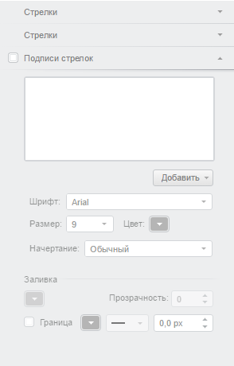

# Конструктор MapArrowLabelPanel

Конструктор MapArrowLabelPanel
-

# Конструктор MapArrowLabelPanel

## Синтаксис

PP.Ui.MapArrowLabelPanel(settings);

## Параметры

Settings. JSON-объект со значениями
 свойств класса.

## Описание

Конструктор MapArrowLabelPanel создает
 экземпляр класса MapArrowLabelPanel.

## Пример

Для выполнения примера необходимо наличие на html-странице компонента
 [MapChart](../../../Components/MapChart/MapChart.htm) с наименованием
 «map» (см. «[Пример
 создания компонента MapChart](../../../Components/MapChart/MapChart_Example.htm)»). Создадим мастер для работы с картой,
 в котором добавлены панели для работы со стрелками:

// Создадим мастер для работы с картой
function createMaster() {
    var master = new PP.Ui.MapMaster({
        DataView: map,
        ParentNode: "mapMaster",
        ImagePath: PP.ImagePath,
        ShowBorders: true,
        Id: "Master",
        Height: 500,
        Width: 300
    });
    return master;
}
// Зададим обработчик события PropertyChanged для панелей мастера
var handler;
function getPropertyChangedHandler(master) {
    var handler = null;
    if (master.getItems().lenght > 0) {
        handler = master.getItems()[0].PropertyChanged;
    }
}
// Получим настройки для панелей мастера
function getPanelSettings() {
    var settings = {
        ImagePath: PP.ImagePath,
        ViewType: PP.Ui.NavigationItem,
        PropertyChanged: handler,
        IsRTL: map.getIsRTL(),
        Parent: document.body
    };
    return settings;
}
// Создадим панель мастера для работы со стрелкой на карте
function createMapArrowVisualPanel() {
    var mapArrowVisualPanel = new PP.Ui.MapArrowVisualPanel(getPanelSettings());
    return mapArrowVisualPanel;
}
// Создадим панель мастера для работы со стрелками на карте
function createMapArrowsPanel() {
    var mapArrowsPanel = new PP.Ui.MapArrowsPanel(getPanelSettings());
    return mapArrowsPanel;
}
// Создадим панель мастера для работы с подписями стрелок на карте
function createMapArrowLabelPanel() {
    var settings = getPanelSettings();
    settings.AreMetricsOn = true;
    var mapArrowLabelPanel = new PP.Ui.MapArrowLabelPanel(settings);
    return mapArrowLabelPanel;
}
// Заполним мастер панелями
function addPanels(master) {
     // Добавим панель для работы со стрелкой на карте
    var mapArrowVisualPanel = createMapArrowVisualPanel();
    master.addMasterPanel(mapArrowVisualPanel);
    // Добавим панель для работы со стрелками
    var mapArrowsPanel = createMapArrowsPanel();
    master.addMasterPanel(mapArrowsPanel);
    // Добавим панель для работы с подписями стрелок
    var mapArrowLabelPanel = createMapArrowLabelPanel();
    master.addMasterPanel(mapArrowLabelPanel);
}
// Создадим мастер для работы с картой
var master = createMaster();
// Удалим все панели у мастера
master.clearItems();
// Заполним мастер заданными панелями
addPanels(master);
После выполнения примера отобразится мастер, содержащий панели для работы
 со стрелками и подписями:

См. также:

[MapArrowLabelPanel](MapArrowLabelPanel.htm)

		Справочная
		 система на версию 10.9
		 от 18/08/2025,
		 © ООО «ФОРСАЙТ»,
