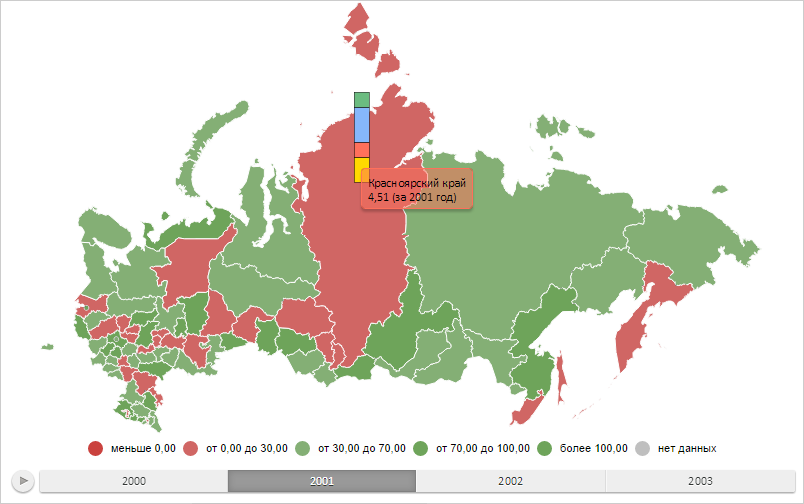

# Конструктор MapBar

Конструктор MapBar
-

# Конструктор MapBar

## Синтаксис

PP.MapBar(settings);

## Параметры

settings. JSON-объект со значениями
 свойств класса.

## Описание

Конструктор MapBar создаёт экземпляр
 класса MapBar.

## Пример

Для выполнения примера необходимо наличие на html-странице компонента
 [MapChart](../../../Components/MapChart/MapChart.htm) с наименованием
 «map» (см. «[Пример
 создания компонента MapChart](../../../Components/MapChart/MapChart_Example.htm)»). Создадим столбиковый показатель для
 области слоя карты с идентификатором «RU-KYA» и отобразим всплывающую
 подсказку для него:

// Возвращает слой с областями карты
function getWorkLayer() {
    return map.getLayer("Regions");
}
// Возвращает текущую отметку измерения для оси карты
function getTimelineIndex() {
    return map.getTimeline().getCurrentStep();
}
// Возвращает базовый класс столбикового показателя карты
function getBarVisual() {
    return map.getVisuals().barVisual0;
}
/* Создаёт объект для работы с настройками сопоставления данных
для столбикового показателя */
function createBarVisual() {
    var barVisual = new PP.BarVisual({
        BorderMappings: getBarVisual().getBorderMappings(),
        ColorMappings: getBarVisual().getColorMappings(),
        HeightMappings: getBarVisual().getHeightMappings(),
        WidthMappings: getBarVisual().getWidthMappings()
    });
    // Настраиваем объект базового класса столбикового показателя
    barVisual.setup(getTimelineIndex());
    return barVisual;
}
// Выводит информацию о столбиковом показателе
function printBarVisualInfo(mapBar) {
    console.log("Главное сопоставление данных: %s", mapBar.getMainMappingId(getTimelineIndex()));
    console.log("Максимальное количество сопоставлений данных: %s", mapBar.getVisual().getMappingsCount());
    console.log("Идентификатор источника данных для первого сопоставления: %s", mapBar.getVisual().getFirstDataSource().getId());
}
// Возвращает область слоя карты с указанным идентификатором
function getShape(shapeId) {
    var shape = getWorkLayer().getParentLayer().getShape(shapeId);
    map.setBarHoverness(shape);
    return shape;
}
// Создаёт всплывающую подсказку
function createToolTip() {
    var toolTip = new PP.Ui.ChartTooltipBase({
        HoverMode: PP.HoverMode.Click,
        MaskText: {
            IsAuto: true,
            Value: "{%Name} \n {%HeightValue} (за {%TimelineStep} год)"
        }
    });
    toolTip.setFont(new PP.Font());
    return toolTip;
}
// Отрисовывает всплывающую подсказку
function drawToolTip(mapBar) {
    // Определяем цвет заливки всплывающей подсказки
    var toolTipColor = mapBar.getToolTipColor();
    mapBar.getToolTip().setBackground(new PP.SolidColorBrush({
        Color: toolTipColor,
        Opacity: 0.5
    }));
    // Отображаем всплывающую подсказку
    mapBar.toggleToolTip();
    if(!mapBar.getToolTip().getIsVisible()) {
        //mapBar.toggleToolTip();
    }
}
// Создаёт столбиковый показатель
function createMapBar() {
    // Создаём столбиковый показатель
    var mapBar = new PP.MapBar({
        Chart: map,
        Shape: getShape("RU-KYA"),
        MaxBarsCount: 6, // Максимальное количество столбцов
        BorderThickness: 0.5, // Толщина границы столбцов
        Visual: createBarVisual(),
        Layer: getWorkLayer(), // Слой карты
        LeastWidthPart: 10, // Минимальная ширина столбца
        LeastHeightPart: 15, // Минимальная высота столбца
        IsPercentage: true, // Значение столбца является процентным показателем
        HideZeroHeight: true, // Столбцы с нулевым значением будут скрыты
        ToolTip: createToolTip() // Всплывающая подсказка
    });
    return mapBar;
}
// Отрисовывает столбиковый показатель
function drawMapBar(mapBar) {
    mapBar.setSelectedIndex(getTimelineIndex());
    mapBar.getLayer().getMapBarCollection().push(mapBar);
    // Заново отрисовываем карту
    map.draw();
}
// Выводит информацию, отображаемую в всплывающей подсказке
function printToolTipInfo(mapBar) {
    // Устанавливаем столбиковый показатель
    var bar1 = {};
    var barKey = "mapBar";
    bar1[barKey] = mapBar.getSettings();
    getWorkLayer().setBars(bar1);
    var bar2 = getWorkLayer().getBars()["mapBar"];
    console.log("Всплывающая подсказка отображает данные для региона «%s» за %s год",
        bar2.getShapeId(), bar2.getToolTipValues().TimelineStep);
}
// Создаём столбиковый показатель
var mapBar = createMapBar();
// Отрисовываем данный показатель
drawMapBar(mapBar);
// Отображаем всплывающую подсказку
drawToolTip(mapBar);
// При изменении года на временной оси будем обновлять подсказку
map.getTimeline().ValueChanged.add(function(sender, args) {
    // Скрываем всплывающую подсказку
    mapBar.toggleToolTip();
    mapBar.setSelectedIndex(getTimelineIndex());
    // Отображаем всплывающую подсказку
    drawToolTip(mapBar);
});
В результате выполнения примера были отображены столбиковый показатель
 для области слоя карты с идентификатором «RU-KYA» и всплывающая подсказка
 для данного показателя. Значения столбцов выражены в процентах:

Теперь определим информацию о настройках сопоставления данных для столбикового
 показателя:

printBarVisualInfo(mapBar);
После выполнения данной строки сценария в консоли браузера были выведены
 наименование главного сопоставления данных, максимальное количество настроек
 сопоставлений данных и идентификатор источника данных для первого сопоставления:

Главное сопоставление данных: BarHeightDataDependency

Максимальное количество настроек сопоставлений данных: 1

Идентификатор источника данных для первого сопоставления
 данных: DataSource0

Далее воспроизведём анимацию для столбикового показателя с длительностью,
 равной половине общего времени её воспроизведения:

mapBar.animate(0.5, [mapBar.getAnimationType()]);
В результате выполнения данной строки сценария всплывающая подсказка
 будет перемещена на несколько пикселей вверх.

Определим, для какого региона и за какой год отображены данные на всплывающей
 подсказке:

printToolTipInfo(mapBar);
После выполнения примера в консоли браузера будут выведены идентификатор
 региона и год, для которых отображены данные на подсказке:

Всплывающая подсказка отображает данные для региона
 «RU-KYA» за 2001 год

См. также:

[MapBar](MapBar.htm)

		Справочная
		 система на версию 10.9
		 от 18/08/2025,
		 © ООО «ФОРСАЙТ»,
