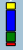
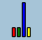

# MapBar.IsPercentage

MapBar.IsPercentage
-

# MapBar.IsPercentage

## Синтаксис

IsPercentage: Boolean;

## Описание

Свойство IsPercentage определяет,
 является ли значение столбца процентным показателем.

## Комментарии

Значение свойства устанавливается из JSON и с помощью метода setIsPercentage,
 а возвращается с помощью метода getIsPercentage.

Допустимые значения:

	- true.
	 Значение столбца является процентным показателем: ;

	- false.
	 Значение столбца имеет абсолютную величину: 
	 (по умолчанию).

## Пример

Пример использования приведён на странице описания [конструктора
 класса PP.MapBar](Constructor_MapBar.htm).

См. также:

[MapBar](MapBar.htm)

		Справочная
		 система на версию 10.9
		 от 18/08/2025,
		 © ООО «ФОРСАЙТ»,
