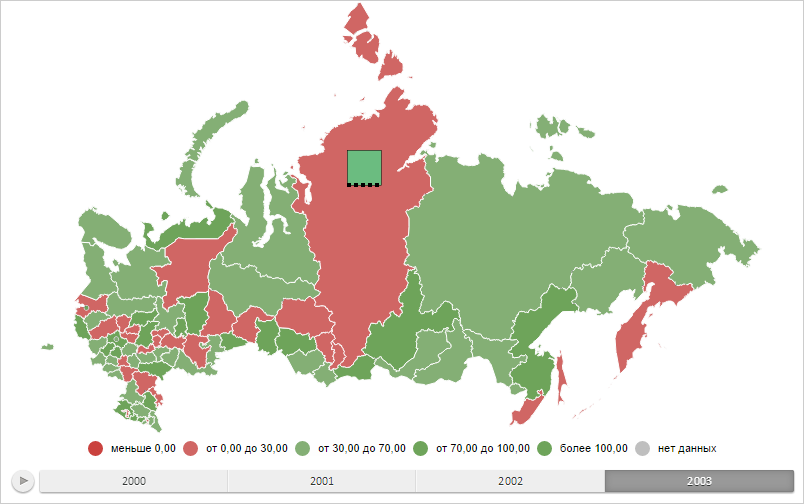

# Конструктор MapBarAxis

Конструктор MapBarAxis
-

# Конструктор MapBarAxis

## Синтаксис

PP.MapBarAxis(settings: Object);

## Параметры

settings. JSON-объект со значениями
 свойств класса.

## Описание

Конструктор MapBarAxis создает
 экземпляр класса MapBarAxis.

## Пример

Для выполнения примера необходимо наличие на html-странице компонента
 [MapChart](../../../Components/MapChart/MapChart.htm) с наименованием
 «map» (см. «[Пример
 создания компонента MapChart](../../../Components/MapChart/MapChart_Example.htm)»). Создадим столбиковый показатель для
 области слоя карты с идентификатором «RU-KYA», содержащий ось и отображающий
 данные только за первый период времени:

// Возвращает слой с областями карты
function getWorkLayer() {
    return map.getLayer("Regions");
}
// Возвращает текущую отметку измерения для оси карты
function getSelectedIndex() {
    return 2;
}
// Возвращает базовый класс столбикового показателя карты
function getBarVisual() {
    return map.getVisuals().barVisual0;
}
// Возвращает область слоя карты с указанным идентификатором
function getShape(shapeId) {
    var shape = getWorkLayer().getParentLayer().getShape(shapeId);
    map.setBarHoverness(shape);
    return shape;
}
// Возвращает настройки сопоставления данных высоте элементов визуализатора
function getHeightMapping() {
    return getBarVisual().getHeightMappings()[0];
}
// Устанавливаем настройки сопоставления данных
function setupHeightMapping() {
    getHeightMapping().setType(PP.DataMappingType.Transformer);
    var dataTransformer = new PP.CoordinateTransformer({
        IncludeZero: true,
        UseSignDivision: true,
    });
    dataTransformer.getValue = function getValue(data) {
        if (!this.getUseSignDivision()) {
            return this.getValue(data);
        } else {
            // Удваиваем входное значение
            return data * 2;
        }
    }
    getHeightMapping().setDataTransformer(dataTransformer);
}
// Создаёт ось для столбикового показателя
function createBarAxis() {
    var barAxis = new PP.MapBarAxis({
        Pen: new PP.Pen({
            Color: PP.Color.Colors.black, // Цвет деления
            Style: PP.PenStyle.Dashed, // Стиль линии для деления
            Width: 4 // Ширина деления
        }),
        Visibility: PP.Ui.Visibility.Hidden
    });
    // Подготавливаем ось для рисования
    barAxis.prepareToRender(map.getBarLayer());
    return barAxis;
}
// Скрывает ось для столбикового показателя
function hideAxis(mapBar) {
    mapBar.getAxis().setVisibility(PP.Ui.Visibility.Hidden);
    mapBar.refresh();
}
// Отображает ось для столбикового показателя
function showAxis(mapBar) {
    mapBar.getAxis().setVisibility(PP.Ui.Visibility.Visible);
    mapBar.refresh();
}
// Создаёт столбиковый показатель
function createMapBar() {
    // Создаём столбиковый показатель
    var mapBar = new PP.MapBar({
        Axis: createBarAxis(), // Ось для столбикового представления
        AllPeriod: false,
        Chart: map,
        Shape: getShape("RU-KYA"), // Область слоя карты, для которой строим показатель
        BorderThickness: 0.5, // Толщина границы столбцов
        Visual: getBarVisual(),
        // Ширина столбца с минимальным значением
        LeastWidthPart: getHeightMapping().getDataTransformer().getValue(2.5),
        // Высота столбца с минимальным значением
        LeastHeightPart: getHeightMapping().getDataTransformer().getValue(17.5),
        IsPercentage: true
    });
    mapBar.refresh = function () {
        this.getChart().draw();
    }
    return mapBar;
}
// Отрисовывает столбиковый показатель
function drawMapBar(mapBar) {
    mapBar.setSelectedIndex(getSelectedIndex());
    mapBar.getLayer().getMapBarCollection().push(mapBar);
    // Заново отрисовываем карту
    mapBar.refresh();
}
// Устанавливаем настройки сопоставления данных
setupHeightMapping();
// Создаём столбиковый показатель
var mapBar = createMapBar();
// Отрисовываем данный показатель
drawMapBar(mapBar);
// Отображаем ось
showAxis(mapBar);
В результате выполнения примера был отображён столбиковый показатель
 для области слоя карты с идентификатором «RU-KYA», содержащий ось и отображающий
 данные только за первый период времени:

См. также:

[MapBarAxis](MapBarAxis.htm)

		Справочная
		 система на версию 10.9
		 от 18/08/2025,
		 © ООО «ФОРСАЙТ»,
