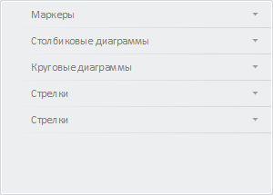

# Конструктор MapBarVisualPanel

Конструктор MapBarVisualPanel
-

# Конструктор MapBarVisualPanel

## Синтаксис

PP.Ui.MapBarVisualPanel(settings);

## Параметры

settings. JSON-объект со значениями
 свойств класса.

## Описание

Конструктор MapBarVisualPanel создает
 экземпляр класса MapBarVisualPanel.

## Пример

Для выполнения примера необходимо наличие на html-странице компонента
 [MapChart](../../../Components/MapChart/MapChart.htm) с наименованием
 «map» (см. «[Пример
 создания компонента MapChart](../../../Components/MapChart/MapChart_Example.htm)»). Создадим мастер для работы с картой,
 очистим панели, созданные по умолчанию, и добавим в него только панели
 для работы со стрелками, столбиковым и круговым показателями:

// Создаёт мастер для работы с картой
function createMaster() {
    var master = new PP.Ui.MapMaster({
        DataView: map,
        ParentNode: "mapMaster",
        ImagePath: PP.ImagePath,
        ShowBorders: true,
        Id: "Master",
        Height: 500,
        Width: 300
    });
    return master;
}
// Обработчик события PropertyChanged для панелей мастера
var handler;
function getPropertyChangedHandler(master) {
    var handler = null;
    if (master.getItems().lenght > 0) {
        handler = master.getItems()[0].PropertyChanged;
    }
}
// Возвращает настройки для панелей мастера
function getPanelSettings() {
    var settings = {
        ImagePath: PP.ImagePath,
        ViewType: PP.Ui.NavigationItem,
        PropertyChanged: handler,
        IsRTL: map.getIsRTL(),
        Parent: document.body
    };
    return settings;
}
// Создаёт панель мастера для работы со столбиковым показателем
function createMapBarVisualPanel() {
    var mapBarVisualPanel = new PP.Ui.MapBarVisualPanel(getPanelSettings());
    return mapBarVisualPanel;
}
// Создаёт панель мастера для работы с круговом показателем
function createMapPieVisualPanel() {
    var mapPieVisualPanel = new PP.Ui.MapPieVisualPanel(getPanelSettings());
    return mapPieVisualPanel;
}
// Создаёт панель мастера для работы со стрелкой на карте
function createMapArrowVisualPanel() {
    var mapArrowVisualPanel = new PP.Ui.MapArrowVisualPanel(getPanelSettings());
    return mapArrowVisualPanel;
}
// Создаёт панель мастера для работы со стрелками на карте
function createMapArrowsPanel() {
    var mapArrowsPanel = new PP.Ui.MapArrowsPanel(getPanelSettings());
    return mapArrowsPanel;
}
// Создаёт панель мастера для работы со маркерами на карте
function createMapMarkerPanel() {
    var mapMarkerPanel = new PP.Ui.MapMarkerVisualPanel(getPanelSettings());
    return mapMarkerPanel;
}
// Заполняет мастер панелями
function addPanels(master) {
    // Добавляем панель для работы со столбиковым показателем
    var mapBarVisualPanel = createMapBarVisualPanel();
    master.addMasterPanel(mapBarVisualPanel);
    // Добавляем панель для работы с круговым показателем
    var mapPieVisualPanel = createMapPieVisualPanel();
    master.addMasterPanel(mapPieVisualPanel);
    // Добавляем панель для работы со стрелкой на карте
    var mapArrowVisualPanel = createMapArrowVisualPanel();
    master.addMasterPanel(mapArrowVisualPanel);
    // Добавляем панель для работы со стрелками
    var mapArrowsPanel = createMapArrowsPanel();
    master.addMasterPanel(mapArrowsPanel);
    // Добавляем панель для работы с маркерами
    var mapMarkerPanel = createMapMarkerPanel();
    master.addMasterPanel(mapMarkerPanel);
}
// Создаём мастер для работы с картой
var master = createMaster();
// Удаляем все панели у мастера
master.clearItems();
// Заполняем мастер панелями
addPanels(master);
В результате выполнения примера был создан мастер, содержащий панели
 для работы со стрелками, столбиковым, круговым показателями и маркерами:

См. также:

[MapBarVisualPanel](MapBarVisualPanel.htm)

		Справочная
		 система на версию 10.9
		 от 18/08/2025,
		 © ООО «ФОРСАЙТ»,
