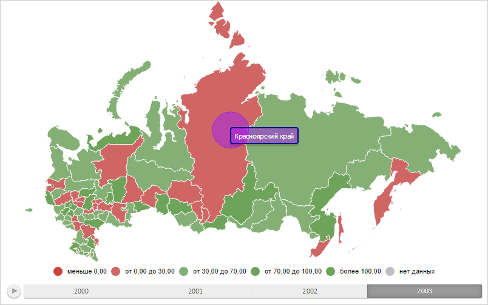

# Конструктор MapBubble

Конструктор MapBubble
-

# Конструктор MapBubble

## Синтаксис

PP.MapBubble(settings);

## Параметры

settings. JSON-объект со значениями
 свойств класса.

## Описание

Конструктор MapBubble создаёт
 экземпляр класса MapBubble.

## Пример

Для выполнения примера необходимо наличие на html-странице компонента
 [MapChart](../../../Components/MapChart/MapChart.htm) с наименованием
 «map» (см. «[Пример
 создания компонента MapChart](../../../Components/MapChart/MapChart_Example.htm)»). Создадим пузырьковый показатель для
 области слоя карты с идентификатором «RU-KYA» и отобразим всплывающую
 подсказку для него:

// Возвращает слой с областями карты
function getWorkLayer() {
    return map.getLayer("Regions");
}
// Возвращает текущую отметку измерения для оси карты
function getTimelineIndex() {
    return 1;
}
// Возвращает базовый класс пузырькового показателя карты
function getBubbleVisual() {
    return map.getVisuals().bubbleVisual0;
}

// Возвращает область слоя карты с указанным идентификатором
function getShape(shapeId) {
    var shape = getWorkLayer().getParentLayer().getShape(shapeId);
    map.setBubbleHoverness(shape);
    return shape;
}
// Создаёт всплывающую подсказку
function createToolTip() {
    var toolTip = new PP.Ui.ChartTooltipBase({
        HoverMode: PP.HoverMode.Click,
        MaskText: {
            IsAuto: true,
            Value: "{%Name}"
        }
    });
    toolTip.setFont(new PP.Font({
        Color: PP.Color.Colors.white
    }));
    return toolTip;
}

// Отрисовывает всплывающую подсказку
function drawToolTip(mapBubble) {
    // Определяем цвет заливки всплывающей подсказки
    mapBubble.getToolTip().setBackground(new PP.SolidColorBrush({
        Color: mapBubble.getToolTipColor(),
        Opacity: 0.5
    }));
    // Определяем границу всплывающей подсказки для пузырькового показателя
    mapBubble.getToolTip().setBorder(new PP.Border({
        Color: mapBubble.getChart().getToolTipColor(mapBubble, PP.Color.Colors.darkblue),
        Width: 2,
        Radius: 3
    }));
    /* Используем собственный цвет границы
    для всплывающей подсказки пузырькового показателя */
    mapBubble.getChart().setUseItemColorForToolTipBorder(false);
    // Отображаем всплывающую подсказку
    mapBubble.toggleToolTip();
}

// Создаёт пузырьковый показатель
function createMapBubble() {
    // Создаём пузырьковый показатель
    var mapBubble = new PP.MapBubble({
        Chart: map,
        Shape: getShape("RU-KYA"),
        Visual: getBubbleVisual(),
        Layer: getWorkLayer(), // Слой карты
        LeastSizePart: 30, // Минимальный диаметр пузырька
        ToolTip: createToolTip(), // Всплывающая подсказка
    });
    // Обновляет пузырьковый показатель
    mapBubble.refresh = function() {
        // Удаляем пузырьковый показатель со слоя карты
        clearMapBubble(this);
        // Проверяем наличие нескольких сопоставлений данных
        if (!mapBubble.isMeta()) {
            this._isDrawed = false;
        }
        // Перерисовываем пузырьковый показатель
        this.draw();
        // Отображаем пузырьковый показатель
        this.renderFrame(this.getChart().getBubbleLayer())
    };

    return mapBubble;
}
// Удаляет пузырьковый показатель со слоя карты
function clearMapBubble(mapBubble) {
    mapBubble.clear();
    mapBubble.getChart().getBubbleLayer().clear();
}
// Отрисовывает пузырьковый показатель
function drawMapBubble(mapBubble) {
    mapBubble.setSelectedIndex(getTimelineIndex());
    mapBubble.getLayer().getMapBubbleCollection().push(mapBubble);
    // Отрисовываем пузырьковый показатель
    mapBubble.draw();
    // Устанавливаем расположение показателя
    var shapeCenter = mapBubble.getShape().getCenter()
    mapBubble.updatePosition(shapeCenter.getX(), shapeCenter.getY());
    // Перерисовываем слой карты
    getWorkLayer().renderFrame();
}

// Выводит информацию, отображаемую в всплывающей подсказке
function printToolTipInfo(mapBubble) {
    // Устанавливаем пузырьковый показатель
    var bubble1 = {};
    var bubbleKey = "mapBubble";
    bubble1[bubbleKey] = mapBubble.getSettings();

    getWorkLayer().setBubbles(bubble1);
    var bubble2 = getWorkLayer().getBubbles()["mapBubble"];
    console.log("Всплывающая подсказка отображает данные для региона «%s» за %s год",
        bubble2.getShapeId(), bubble2.getToolTipValues().TimelineStep);
    }
// Создаём пузырьковый показатель
var mapBubble = createMapBubble();
// Отрисовываем данный показатель
drawMapBubble(mapBubble);
// Отображаем всплывающую подсказку
drawToolTip(mapBubble);
В результате выполнения примера были отображены пузырьковый показатель
 для области слоя карты с идентификатором «RU-KYA» и всплывающая подсказка
 для данного показателя:

Определим, для какого региона и за какой год отображены данные на всплывающей
 подсказке:

printToolTipInfo(mapBubble);
После выполнения примера в консоли браузера будут выведены идентификатор
 региона и год, для которых отображены данные на подсказке:

Всплывающая подсказка отображает данные для региона
 «RU-KYA» за 2003 год

См. также:

[MapBubble](MapBubble.htm)

		Справочная
		 система на версию 10.9
		 от 18/08/2025,
		 © ООО «ФОРСАЙТ»,
