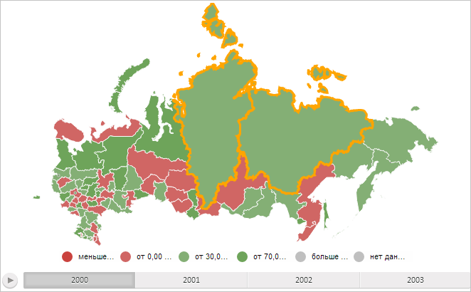

# MapChart.ActiveItems

MapChart.ActiveItems
-

# MapChart.ActiveItems

## Синтаксис

ActiveItems: Object;

## Описание

Свойство ActiveItems определяет активные области слоя карты.

## Комментарии

Значение свойства задаётся из JSON и с помощью метода setActiveItems.

Свойство содержит JSON-объект с полями, наименования которых соответствуют идентификатору области слоя карты. Эти поля могут иметь значение true, если область активна, или значение false, если она не активна.

## Пример

Для выполнения примера необходимо наличие на html-странице компонента [MapChart](../../../Components/MapChart/MapChart.htm) с наименованием «map» (см. «[Пример создания компонента MapChart](../../../Components/MapChart/MapChart_Example.htm)»). Определим на карте активные области и увеличим толщину их границы:

// Определим активные области слоя карты
var activeItems = {
    "RU-SA": true,
    "RU-KYA": true
};
// Установим активные области слоя карты
map.setActiveItems(activeItems);
for (var shapeId in map.getActiveItems()) {
    // Получим активную область карты
    var shape = map.getShape(shapeId);
    // Получим эффект границы области
    var effect = shape.getEffect();
    // Изменим толщину границы
    effect.setBorderThickness(3);
    // Применим эффект
    effect.apply(shape, true);
};

В результате выполнения примера активными стали области слоя карты с идентификаторами «RU-SA» и «RU-KYA», и толщина их границы стала равна 3 пикселям:

См. также:

[MapChart](MapChart.htm)

		Справочная
		 система на версию 10.9
		 от 18/08/2025,
		 © ООО «ФОРСАЙТ»,
