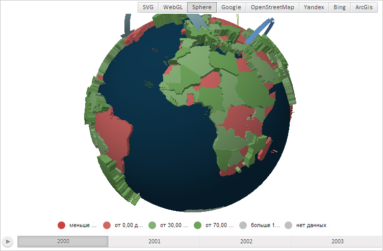
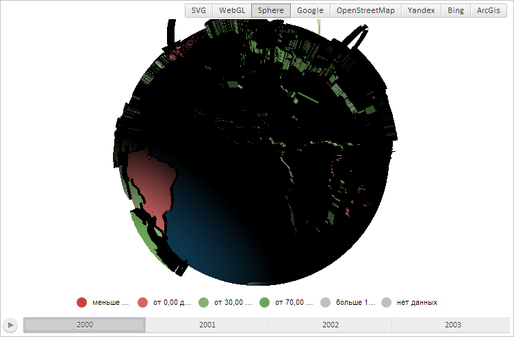

# MapChart.AmbientLightValue

MapChart.AmbientLightValue
-

# MapChart.AmbientLightValue

## Синтаксис

AmbientLightValue: Number;

## Описание

Свойство AmbientLightValue определяет уровень внешнего освещения карты.

## Комментарии

Значение свойства задаётся из JSON и с помощью метода setAmbientLightValue.

По умолчанию свойство содержит значение 0,5.

Данное свойство применимо только для карты с типом отображения «Sphere».

## Пример

Для выполнения примера необходимо наличие на html-странице компонента [MapChart](../../../Components/MapChart/MapChart.htm) с наименованием «map» и компонента [ToolBar](dhtmlUi.chm::/Classes/ToolBar/ToolBar.htm) с наименованием «MapType» (см. «[Пример создания компонента MapChart](../../../Components/MapChart/MapChart_Example.htm)»). Также требуется, чтобы была загружена карта с топоосновой Sphere. Для изменения её типа выполним в консоли браузера следующую строку сценария:

MapType.setIsVisible(true);

Затем нажмём на кнопку «Sphere», расположенную на появившейся панели. После этого будет отображена карта типа «Sphere»:

Теперь зададим новый уровень и направление внешнего освещения карты:

// Установим новый уровень внешнего освещения карты
map.setAmbientLightValue(-2);
// Установим направление освещения
map.setDirectLightDirection(new PP.Vector3(1, 1, -0.5));
// Перерисуем карту
map.draw(0);
this.onresize();

В результате выполнения примера внешнее освещение карты было уменьшено, а направление освещения изменено на северо-восточное:

См. также:

[MapChart](MapChart.htm)

		Справочная
		 система на версию 10.9
		 от 18/08/2025,
		 © ООО «ФОРСАЙТ»,
