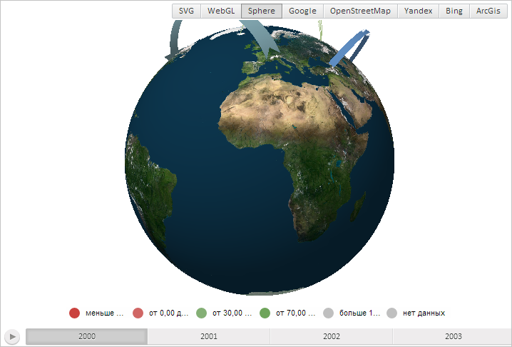

# MapChart.DisableVisuals

MapChart.DisableVisuals
-

# MapChart.DisableVisuals

## Синтаксис

DisableVisuals: Boolean;

## Описание

Свойство DisableVisuals отключает отображение всех показателей карты.

## Комментарии

Значение свойства задаётся из JSON и с помощью метода setVisuals.

Если свойство содержит значение true, то отображение показателей карты разрешено, если оно равно значению false (по умолчанию), то будет отключено.

## Пример

Для выполнения примера необходимо наличие на html-странице компонента [MapChart](../../../Components/MapChart/MapChart.htm) с наименованием «map» и компонента [ToolBar](dhtmlUi.chm::/Classes/ToolBar/ToolBar.htm) с наименованием «MapType» (см. «[Пример создания компонента MapChart](../../../Components/MapChart/MapChart_Example.htm)»). Также требуется, чтобы была загружена карта с типом отображения «Sphere» (см. страницу описания свойства [MapChart.AmbientLightValue](MapChart.AmbientLightValue.htm)).

Отключим отображение показателей карты:

map.setDisableVisuals(true);

В результате выполнения примера будет отображён глобус без областей слоя карты:

См. также:

[MapChart](MapChart.htm)

		Справочная
		 система на версию 10.9
		 от 18/08/2025,
		 © ООО «ФОРСАЙТ»,
