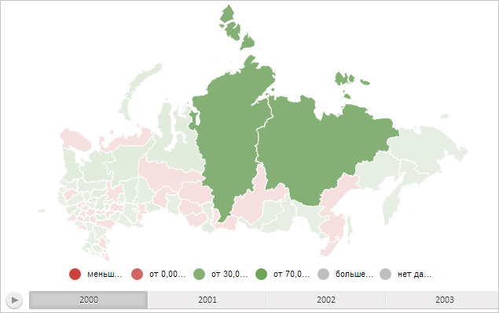

# MapChart.InactiveItemsOpacity

MapChart.InactiveItemsOpacity
-

# MapChart.InactiveItemsOpacity

## Синтаксис

InactiveItemsOpacity: Number;

## Описание

Свойство InactiveItemsOpacity
 определяет прозрачность неактивных областей слоя карты.

## Комментарии

Значение свойства устанавливается из JSON и с помощью метода setInactiveItemsOpacity.
 Оно меняется в диапазоне от 0 (полностью прозрачная область) до 1 (абсолютно
 непрозрачная область слоя карты).

## Пример

Для выполнения примера необходимо наличие на html-странице компонента
 [MapChart](../../../Components/MapChart/MapChart.htm) с наименованием
 «map» (см. «[Пример
 создания компонента MapChart](../../../Components/MapChart/MapChart_Example.htm)»). Уменьшим прозрачность неактивных областей:

// Установим коэффициент прозрачности неактивных областей
map.setInactiveItemsOpacity(0.2);
// Отрисуем карту с данными за начальный год
map.draw(0);
В результате выполнения примера, при выделения мышкой области слоя карты
 прозрачность остальных (неактивных) областей будет равна 20%:

См. также:

[MapChart](MapChart.htm)

		Справочная
		 система на версию 10.9
		 от 18/08/2025,
		 © ООО «ФОРСАЙТ»,
