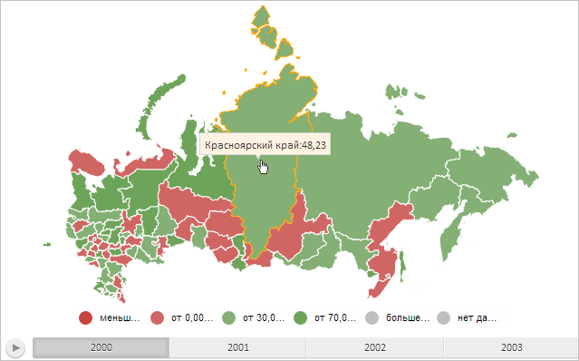

# MapChart.IsHandCursor

MapChart.IsHandCursor
-

# MapChart.IsHandCursor

## Синтаксис

IsHandCursor: Boolean;

## Описание

Свойство IsHandCursor определяет, отображается ли указатель мыши в режиме «Выбор ссылки» при наведении на область слоя карты.

## Комментарии

Значение свойства устанавливается из JSON и с помощью метода setIsHandCursor.

Если свойство равно значению true, то указатель мыши при наведении на область слоя карты будет отображаться в режиме «Выбор ссылки» (), если значению false (по умолчанию), то в основном режиме ().

## Пример

Для выполнения примера необходимо наличие на html-странице компонента [MapChart](../../../Components/MapChart/MapChart.htm) с наименованием «map» (см. «[Пример создания компонента MapChart](../../../Components/MapChart/MapChart_Example.htm)»). Разрешим указателю мыши при наведении его на область слоя карты переключаться в режим «Выбор ссылки»:

map.setIsHandCursor(true);

В результате выполнения примера указатель мыши при наведении на область слоя карты будет отображаться в режиме «Выбор ссылки»:

См. также:

[MapChart](MapChart.htm)

		Справочная
		 система на версию 10.9
		 от 18/08/2025,
		 © ООО «ФОРСАЙТ»,
