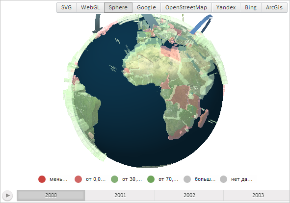

# MapChart.Shape3DOpacity

MapChart.Shape3DOpacity
-

# MapChart.Shape3DOpacity

## Синтаксис

Shape3DOpacity: Number;

## Описание

Свойство Shape3DOpacity определяет прозрачность областей слоя трёхмерной карты.

## Комментарии

Значение свойства устанавливается из JSON и с помощью метода setShape3DOpacity. Оно меняется в диапазоне от 0 (полностью прозрачная область слоя карты) до 1 (абсолютно непрозрачная область, используется по умолчанию).

Свойство Shape3DOpacity работает, если карта имеет тип «Sphere», то есть значение свойства [MapChart.Type](MapChart.Type.htm) должно быть равно PP.MapChartType.Sphere.

## Пример

Для выполнения примера необходимо наличие на html-странице компонента [MapChart](../../../Components/MapChart/MapChart.htm) с наименованием «map» и компонента [ToolBar](dhtmlUi.chm::/Classes/ToolBar/ToolBar.htm) с наименованием «MapType» (см. «[Пример создания компонента MapChart](../../../Components/MapChart/MapChart_Example.htm)»). Также требуется, чтобы была загружена карта с типом отображения «Sphere» (см. страницу описания свойства [MapChart.AmbientLightValue](MapChart.AmbientLightValue.htm)).

Увеличим прозрачность областей слоя карты и отобразим данные за следующий год:

// Установим для областей слоя карты прозрачность, равную 50%
map.setShape3DOpacity(0.5);
// Отобразим карту с данными следующего года
map.draw(1);

В результате выполнения примера прозрачность областей слоя карты увеличилась на 50%, а также на ней были отображены данные за следующий год:

См. также:

[MapChart](MapChart.htm)

		Справочная
		 система на версию 10.9
		 от 18/08/2025,
		 © ООО «ФОРСАЙТ»,
