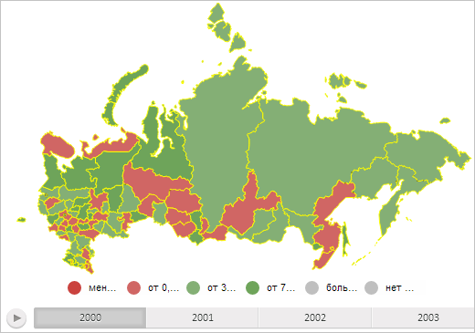

# MapChart.ShapesBorderColor

MapChart.ShapesBorderColor
-

# MapChart.ShapesBorderColor

## Синтаксис

ShapesBorderColor: String | PP.Color;

## Описание

Свойство ShapesBorderColor определяет цвет границ областей слоя карты.

## Комментарии

Значение свойства устанавливается из JSON.

## Пример

Воспользуемся примером создания компонента [MapChart](../../../Components/MapChart/MapChart.htm) со страницы «[Пример создания компонента MapChart](../../../Components/MapChart/MapChart_Example.htm)», добавив в него перед строкой

map = new PP.MapChart(settings.MapChart ? settings.MapChart : settings);

следующую строку сценария:

settings.MapChart.ShapesBorderColor = "#FFFF00";

В результате выполнения примера границы областей слоя карты будут окрашены в жёлтый цвет:

См. также:

[MapChart](MapChart.htm)

		Справочная
		 система на версию 10.9
		 от 18/08/2025,
		 © ООО «ФОРСАЙТ»,
