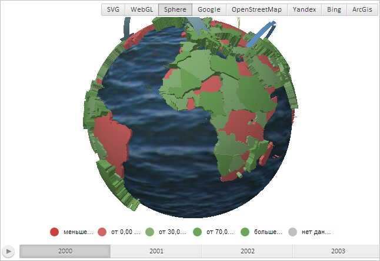

# MapChart.SphereTexture

MapChart.SphereTexture
-

# MapChart.SphereTexture

## Синтаксис

SphereTexture: String;

## Описание

Свойство SphereTexture определяет
 адрес изображения, используемого в качестве текстуры для топоосновы Sphere.

## Комментарии

Значение свойства устанавливается из JSON и с помощью метода setSphereTexture,
 а возвращается - с помощью метода getSphereTexture.

Данное свойство применимо только для карты с топоосновой Sphere.

## Пример

Для выполнения примера необходимо наличие на html-странице компонента
 [MapChart](../../../Components/MapChart/MapChart.htm) с наименованием
 «map» (см. «[Пример
 создания компонента MapChart](../../../Components/MapChart/MapChart_Example.htm)»). Также должна быть загружена карта
 типа «Sphere», для этого нужно выполнить следующую строку сценария:

changeMapType("Sphere");
Также необходимо наличие в папке с изображениями файла текстуры с наименованием
 «water.png» и с размером 512 на 512 пикселей.

Установим новую текстуру для топоосновы карты Sphere:

var texture = PP.ImagePath + "water.png";
map.setSphereTexture(texture);
В результате выполнения примера была загружена и установлена новая текстура
 для карты:

См. также:

[MapChart](MapChart.htm)

		Справочная
		 система на версию 10.9
		 от 18/08/2025,
		 © ООО «ФОРСАЙТ»,
