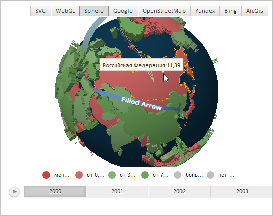
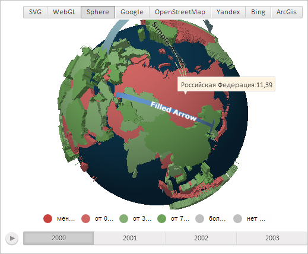

# MapChart.TopoBoundingAngles

MapChart.TopoBoundingAngles
-

# MapChart.TopoBoundingAngles

## Синтаксис

TopoBoundingAngles: PP.Rect;

## Описание

Свойство TopoBoundingAngles определяет прямоугольную область, ограничивающую топооснову карты.

## Комментарии

Значение свойства устанавливается из JSON и с помощью метода setTopoBoundingAngles, а возвращается с помощью метода getTopoBoundingAngles.

## Пример

Для выполнения примера необходимо наличие на html-странице компонента [MapChart](../../../Components/MapChart/MapChart.htm) с наименованием «map» и компонента [ToolBar](dhtmlUi.chm::/Classes/ToolBar/ToolBar.htm) с наименованием «MapType» (см. «[Пример создания компонента MapChart](../../../Components/MapChart/MapChart_Example.htm)»). Также требуется, чтобы была загружена карта с топоосновой Sphere (см. страницу описания свойства [MapChart.AmbientLightValue](MapChart.AmbientLightValue.htm)).

Наведём указатель мыши на область слоя карты, соответствующую России. По умолчанию треугольный элемент всплывающей подсказки будет отображён ближе к её правой стороне в точке наведения указателем:

Разместим треугольный элемент всплывающей подсказки ближе к её левой стороне в точке, соответствующей центру области слоя карты:

// Получим область слоя карты с идентификатором «RU»
var shape = map.getShape("RU");
// Получим всплывающую подсказку для данной области
var tooltip = shape.getToolTip();
// Определим и установим прямоугольную область, ограничивающую топооснову карты
var rect = new PP.Rect({
    Left: 0,
    Width: 100,
});
map.setTopoBoundingAngles(rect);
// Укажем, что карта представлена в виде сферы
shape._Type = PP.MapChartType.Sphere;
tooltip.setChart(map);
// Отобразим всплывающую подсказку
shape.toggleToolTip3d(shape.getCenter());

В результате выполнения примера треугольный элемент всплывающей подсказки был расположен ближе к её левой стороне в точке, соответствующей центру области слоя карты:

См. также:

[MapChart](MapChart.htm)

		Справочная
		 система на версию 10.9
		 от 18/08/2025,
		 © ООО «ФОРСАЙТ»,
