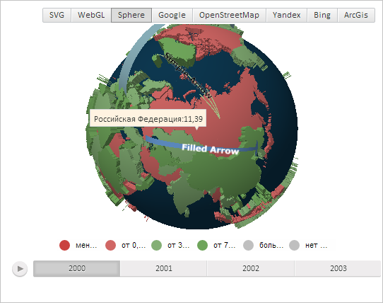

# MapChart.TopoBoundingBox

MapChart.TopoBoundingBox
-

# MapChart.TopoBoundingBox

## Синтаксис

TopoBoundingBox: PP.Box;

## Описание

Свойство TopoBoundingBox определяет куб, ограничивающий топооснову трёхмерной карты.

## Комментарии

Значение свойства устанавливается из JSON и с помощью метода setTopoBoundingAngles.

## Пример

Воспользуемся примером, приведённым на странице описания свойства [MapChart.TopoBoundingAngles](MapChart.TopoBoundingAngles.htm). Теперь вновь разместим треугольный элемент всплывающей подсказки ближе к её правой стороне, заменив фрагмент сценария

// Определим прямоугольник, ограничивающий топооснову
var rect = new PP.Rect({
    Left: 0,
    Width: 100,
});
map.setTopoBoundingAngles(rect);
// Укажем, что карта представлена в виде сферы
shape._Type = PP.MapChartType.Sphere;

на следующий код:

// Получим всплывающую подсказку для данной области
var tooltip = shape.getToolTip();
// Определим куб, ограничивающий топооснову
var box = new PP.Box({
    Left: 0,
    Width: 0,
});
map.setTopoBoundingBox(box);
tooltip.setChart(map);

В результате выполнения примера треугольный элемент всплывающей подсказки был расположен ближе к её правой стороне:

См. также:

[MapChart](MapChart.htm)

		Справочная
		 система на версию 10.9
		 от 18/08/2025,
		 © ООО «ФОРСАЙТ»,
