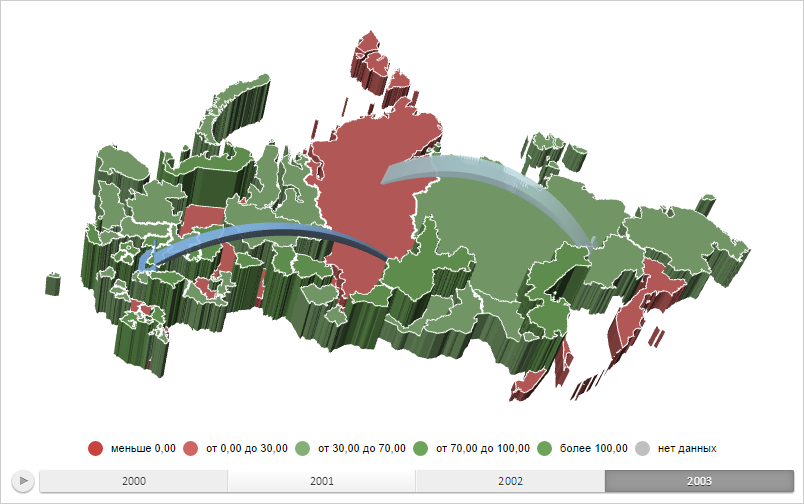

# MapChart.TopoNormalization

MapChart.TopoNormalization
-

# MapChart.TopoNormalization

## Синтаксис

TopoNormalization: Object;

## Описание

Свойство TopoNormalization определяет
 настройки геометрический нормализации топоосновы карты.

## Комментарии

Значение свойства устанавливается из JSON и с помощью метода setTopoNormalization.,
 а возвращается с помощью метода getTopoNormalization.

Свойство содержит JSON-объект со следующими полями: norm - коэффициент
 нормализации топоосновы, offsetx - отступ по оси X, offsety - отступ по
 оси Y, offsetz - отступ по оси Z.

## Пример

Для выполнения примера необходимо наличие на html-странице компонента
 [MapChart](../../../Components/MapChart/MapChart.htm) с наименованием
 «map» и компонента [ToolBar](dhtmlUi.chm::/Classes/ToolBar/ToolBar.htm) с наименованием
 «MapType» (см. «[Пример
 создания компонента MapChart](../../../Components/MapChart/MapChart_Example.htm)»). Также требуется, чтобы была загружена
 карта с топоосновой WebGL. Для этого выполним в консоли браузера следующую
 строку сценария:

changeMapType("WebGL");
Увеличим коэффициент нормализации топоосновы карты в 2,5 раза:

// Получим область слоя карты с идентификатором «RU-KYA»
var shape = map.getShape("RU-KYA");
console.log("Исходная высота области слоя карты: " + shape.getZValue());
// Получим настройки нормализации
var topoNormalization = map.getTopoNormalization();
// Увеличим коэффициент нормализации в 2.5 раза
topoNormalization.norm *= 2.5;
// Применим настройки нормализации
map.setTopoNormalization(topoNormalization);
shape.setChart(map);
// Перерисуем область слоя карты
shape.draw();
// Обновим карту
map.refresh();
console.log("Полученная высота области слоя карты: " + shape.getZValue());
В результате выполнения примера коэффициент нормализации топоосновы
 карты был увеличен в 2,5 раза:

В консоли браузера были выведены исходное и полученное значения высоты
 для области слоя карты с идентификатором «RU-KYA»:

Исходная высота области слоя карты: 0.0037431996863608076

Полученная высота области слоя карты: 0.009357999215902019

См. также:

[MapChart](MapChart.htm)

		Справочная
		 система на версию 10.9
		 от 18/08/2025,
		 © ООО «ФОРСАЙТ»,
