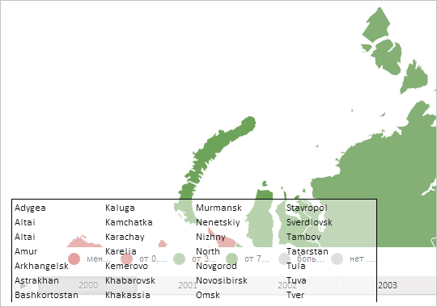

# MapChart.TopobaseSize

MapChart.TopobaseSize
-

# MapChart.TopobaseSize

## Синтаксис

TopobaseSize: Object;

## Описание

Свойство TopobaseSize определяет размер топоосновы карты.

## Комментарии

Значение свойства устанавливается с помощью метода setTopobaseSize. При вызове этого метода используются параметры width и height - ширина и высота топоосновы. Из JSON значение свойства установить нельзя.

Значение свойства возвращается с помощью метода getTopobaseSize. Возвращаемое значение является JSON-объектом с полями width и height.

## Пример

Для выполнения примера необходимо наличие на html-странице компонента [MapChart](../../../Components/MapChart/MapChart.htm) с наименованием «map» (см. «[Пример создания компонента MapChart](../../../Components/MapChart/MapChart_Example.htm)»). Уменьшим размеры топоосновы в 2 раза:

// Получим исходный размер топоосновы карты
var topobaseSize = map.getTopobaseSize();
// Уменьшим размер топоосновы в два раза
map.setTopobaseSize(topobaseSize.width / 2,
    topobaseSize.height / 2
);
// Обновим карту
map.refresh();

В результате выполнения примера ширина и высота топоосновы карты была уменьшена в два раза:

См. также:

[MapChart](MapChart.htm)

		Справочная
		 система на версию 10.9
		 от 18/08/2025,
		 © ООО «ФОРСАЙТ»,
