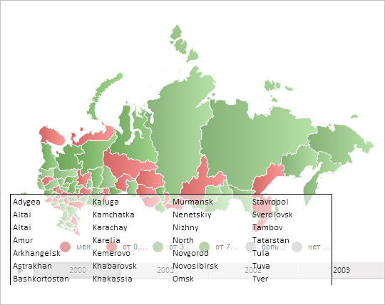

# MapChart.UseMorphFill

MapChart.UseMorphFill
-

# MapChart.UseMorphFill

## Синтаксис

UseMorphFill: Boolean;

## Описание

Свойство UseMorphFill определяет, будет ли использована градиентная заливка для областей слоя карты.

## Комментарии

Значение свойства устанавливается из JSON и с помощью метода setUserMorphFill.

Свойство содержит значение true, если используется градиентная заливка областей слоя карты, иначе - значение false.

## Пример

Для выполнения примера необходимо наличие на html-странице компонента [MapChart](../../../Components/MapChart/MapChart.htm) с наименованием «map» (см. «[Пример создания компонента MapChart](../../../Components/MapChart/MapChart_Example.htm)»). Разрешим градиентную заливку областей слоя карты:

map.setUseMorphFill(true);
// Обновим карту
map.refresh();

В результате выполнения примера в карте была включена градиентная заливка:

См. также:

[MapChart](MapChart.htm)

		Справочная
		 система на версию 10.9
		 от 18/08/2025,
		 © ООО «ФОРСАЙТ»,
