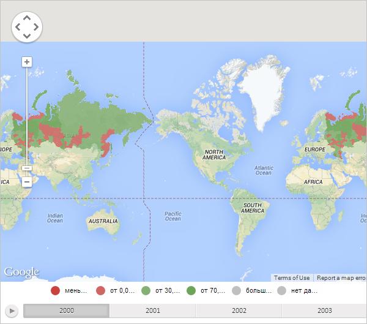

# MapChart.afterGoogleLoad

MapChart.afterGoogleLoad
-

# MapChart.afterGoogleLoad

## Синтаксис

afterGoogleLoad();

## Описание

Метод afterGoogleLoad вызывает действия, требующие выполнения после загрузки карты с топоосновой Google.

## Пример

Для выполнения примера необходимо наличие на html-странице компонента [MapChart](../../../Components/MapChart/MapChart.htm) с наименованием «map» (см. «[Пример создания компонента MapChart](../../../Components/MapChart/MapChart_Example.htm)»). Установим для карты топооснову Google, выполнив в консоли браузера следующую строку сценария:

map.setType(PP.MapChartType.Google);

В результате выполнения примера для карты была установлена топооснова Google:

Теперь обработаем событие [Loaded](MapChart.Loaded.htm) и выполним действия, требующие выполнения после загрузки карты с топоосновой Google:

// Обработаем событие загрузки карты
map.Loaded.add(function (sender, args) {
    console.log("Карта с топоосновой Google загружена");
});
// Вызовем действия, требующие выполнения после загрузки карты Google
map.afterGoogleLoad();

После выполнения примера было вызвано событие Loaded, обработчик которого вывел в консоли браузера следующее сообщение:

Карта с топоосновой Google загружена

См. также:

[MapChart](MapChart.htm)

		Справочная
		 система на версию 10.9
		 от 18/08/2025,
		 © ООО «ФОРСАЙТ»,
