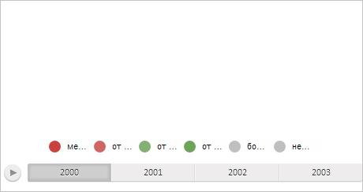

# MapChart.clearLayer

MapChart.clearLayer
-

# MapChart.clearLayer

## Синтаксис

clearLayer(layerNode: HTMLElement);

## Параметры

layerNode. DOM-элемент, соответствующий очищаемому слою.

## Описание

Метод clearLayer очищает указанный слой.

## Пример

Для выполнения примера необходимо наличие на html-странице компонента [MapChart](../../../Components/MapChart/MapChart.htm) с наименованием «map» (см. «[Пример создания компонента MapChart](../../../Components/MapChart/MapChart_Example.htm)»). Очистим все слои карты:

// Получим слои карты
var layers = map.getLayers();
for (var i in layers) {
    // Получим слой
    var layer = layers[i];
    // Удалим его
    map.clearLayer(layer.getDomNode());
};

В результате выполнения примера были очищены все слои карты:

См. также:

[MapChart](MapChart.htm)

		Справочная
		 система на версию 10.9
		 от 18/08/2025,
		 © ООО «ФОРСАЙТ»,
