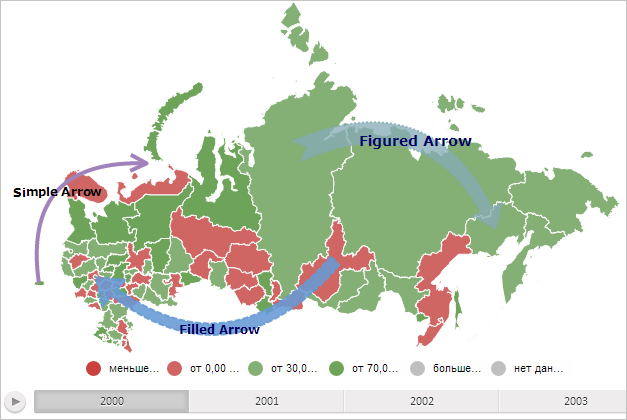

# MapChart.getArrowLayer

MapChart.getArrowLayer
-

# MapChart.getArrowLayer

## Синтаксис

getArrowLayer();

## Описание

Метод getArrowLayer возвращает слой для стрелок карты.

## Комментарии

Метод вовзращает значение типа SVGElement.

## Пример

Для выполнения примера необходимо наличие на html-странице компонента [MapChart](../../../Components/MapChart/MapChart.htm) с наименованием «map» (см. «[Пример создания компонента MapChart](../../../Components/MapChart/MapChart_Example.htm)»). Отобразим на карте все доступные стрелки:

// Получим слой стрелок
var arrowLayer = map.getArrowLayer();
// Добавим все существующие стрелки на карту
for (var i in map._MapArrows) {
    // Получим стрелку
    var arrowNode = map._MapArrows[i].getDomNode();
    // Добавим стрелку на карту
    arrowLayer.appendChild(arrowNode);
};

В результате выполнения примера на карте были отображены все доступные стрелки:

См. также:

[MapChart](MapChart.htm)

		Справочная
		 система на версию 10.9
		 от 18/08/2025,
		 © ООО «ФОРСАЙТ»,
