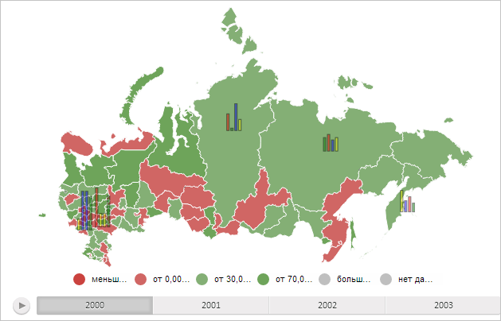

# MapChart.getBarLayer

MapChart.getBarLayer
-

# MapChart.getBarLayer

## Синтаксис

getBarLayer();

## Описание

Метод getBarLayer возвращает слой столбиковых показателей карты.

## Комментарии

Метод возвращает значение типа SVGElement.

## Пример

Для выполнения примера необходимо наличие на html-странице компонента [MapChart](../../../Components/MapChart/MapChart.htm) с наименованием «map» (см. «[Пример создания компонента MapChart](../../../Components/MapChart/MapChart_Example.htm)»). Отобразим на карте все доступные столбиковые показатели и установим для них прозрачность, равную 50%:

// Получим стролбиковые показатели карты
var barVisual = map.getLayer("Regions").getVisuals().BarVisual;
// Сделаем столбиковые показатели видимыми
barVisual.setVisibility(PP.Ui.Visibility.Visible);
// Заново отрисуем карту
map.draw();
// Получим слой столбиковых показателей
var barLayer = map.getBarLayer();
// Увеличим прозрачность слоя на 50%
barLayer.style.opacity = 0.5;

В результате выполнения примера на карте были отображены все доступные столбиковые показатели с прозрачностью, равной 50%:

См. также:

[MapChart](MapChart.htm)

		Справочная
		 система на версию 10.9
		 от 18/08/2025,
		 © ООО «ФОРСАЙТ»,
