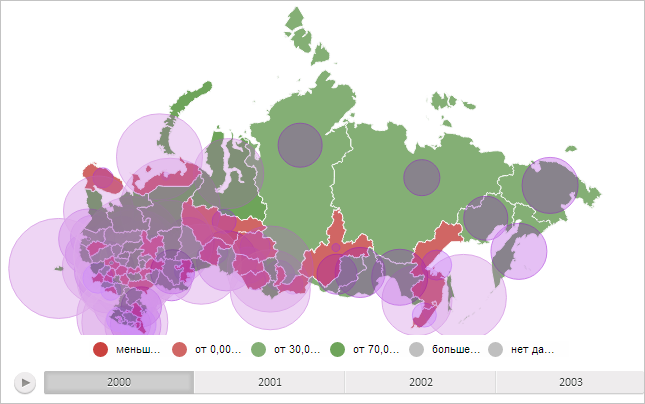

# MapChart.getBubbleLayer

MapChart.getBubbleLayer
-

# MapChart.getBubbleLayer

## Синтаксис

getBubbleLayer();

## Описание

Метод getBubbleLayer возвращает слой пузырьковых показателей карты.

## Комментарии

Метод возвращает значение типа SVGElement.

## Пример

Для выполнения примера необходимо наличие на html-странице компонента [MapChart](../../../Components/MapChart/MapChart.htm) с наименованием «map» (см. «[Пример создания компонента MapChart](../../../Components/MapChart/MapChart_Example.htm)»). Отобразим на карте все доступные пузырьковые показатели и установим для них прозрачность, равную 50%:

// Получим пузырьковые показатели карты
var bubbleVisual = map.getLayer("Regions").getVisuals().BubbleVisual;
// Сделаем пузырьковые показатели видимыми
bubbleVisual.setVisibility(PP.Ui.Visibility.Visible);
// Заново отрисуем карту
map.draw();
// Получим слой столбиковых показателей
var bubbleLayer = map.getBubbleLayer();
// Увеличим прозрачность слоя на 50%
bubbleLayer.style.opacity = 0.5;

В результате выполнения примера на карте были отображены все доступные пузырьковые показатели с прозрачностью, равной 50%:

См. также:

[MapChart](MapChart.htm)

		Справочная
		 система на версию 10.9
		 от 18/08/2025,
		 © ООО «ФОРСАЙТ»,
