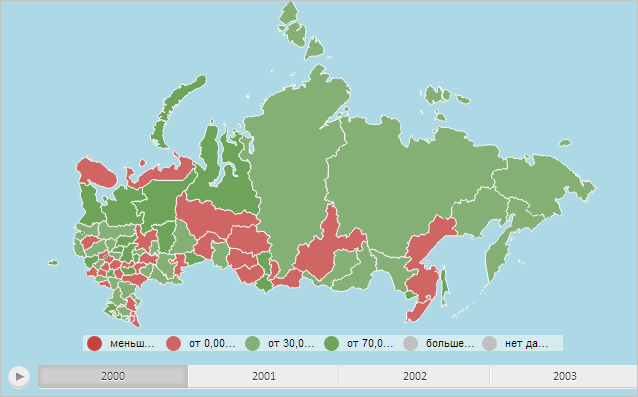

# MapChart.getContentMilestoneLayer

MapChart.getContentMilestoneLayer
-

# MapChart.getContentMilestoneLayer

## Синтаксис

getContentMilestoneLayer();

## Описание

Метод getContentMilestoneLayer возвращает содержимое слоя значков для карты.

## Комментарии

Метод возвращает объект типа HTMLElement.

## Пример

Для выполнения примера необходимо наличие на html-странице компонента [MapChart](../../../Components/MapChart/MapChart.htm) с наименованием «map» (см. «[Пример создания компонента MapChart](../../../Components/MapChart/MapChart_Example.htm)»). Установим для содержимого слоя значков карты заливку голубого цвета:

// Получим содержимое слоя значков карты
var milestoneContentLayer = map.getContentMilestoneLayer();
// Установим для содержимого слоя значков карты заливку голубого цвета
milestoneContentLayer.style.backgroundColor = PP.Color.Colors.lightblue;

В результате выполнения примера для содержимого слоя значков карты была установлена заливка голубого цвета:

См. также:

[MapChart](MapChart.htm)

		Справочная
		 система на версию 10.9
		 от 18/08/2025,
		 © ООО «ФОРСАЙТ»,
