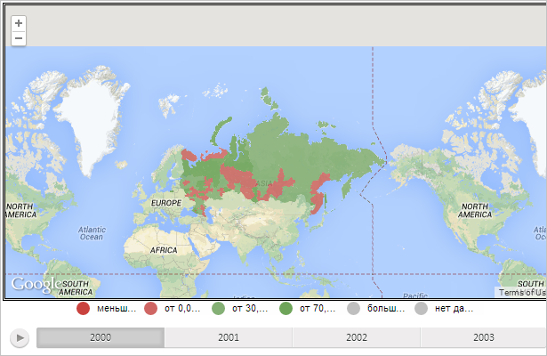

# MapChart.getGMapDomNode

MapChart.getGMapDomNode
-

# MapChart.getGMapDomNode

## Синтаксис

getGMapDomNode();

## Описание

Метод getGMapDomNode возвращает
 DOM-элемент топоосновы карты Google.

## Комментарии

Метод возвращает значение типа HTMLElement.

## Пример

Для выполнения примера необходимо наличие на html-странице компонента
 [MapChart](../../../Components/MapChart/MapChart.htm) с наименованием
 «map» (см. «[Пример
 создания компонента MapChart](../../../Components/MapChart/MapChart_Example.htm)»). Также требуется, чтобы была загружена
 карта с топоосновой Google (см. страницу описания свойства [MapChart.afterGoogleLoad](MapChart.afterGoogleLoad.htm)).

Определим адрес отображаемого фрагмента карты Google и зададим для неё
 границу:

// Проверим, загружена ли карта
if (map.isLoaded) {
    // Получим объект с настройками карты Google
    var googleMap = map.getGoogleMap();
    if (googleMap != null) {
        // Определим адрес отображаемой карты
        console.log("Адрес отображаемого фрагмента карты: " + googleMap.mapUrl);
        // Получим DOM-элемент карты Google
        var gMapDomNode = map.getGMapDomNode();
        // Определим границу для DOM-элемента
        gMapDomNode.style.borderColor = PP.Color.Colors.black;
        gMapDomNode.style.borderWidth = 5;
        gMapDomNode.style.borderStyle = "double";
    } else {
        console.log("Карта Google не загружена");
    }
} else {
    console.log("Карта ещё не загружена");
};
// Проверим, содержит ли карта выделенные элементы
console.log(map.isSomethingSelected() ? "Карта содержит выделенные элементы" : "Элементы карты не выделены");
В результате выполнения примера в консоли браузера был выведен адрес
 отображаемого фрагмента карты Google:

Адрес отображаемого фрагмента карты: http://maps.google.com/maps?ll=68.978625,104.861216&z=1&t=m&hl=en-US&mapclient=apiv3

Также для карты была установлена граница в виде двойной сплошной линии
 чёрного цвета:

См. также:

[MapChart](MapChart.htm)

		Справочная
		 система на версию 10.9
		 от 18/08/2025,
		 © ООО «ФОРСАЙТ»,
