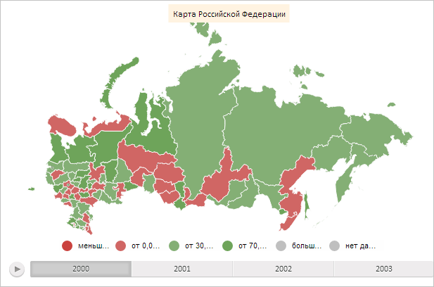

# MapChart.getLabelLayer

MapChart.getLabelLayer
-

# MapChart.getLabelLayer

## Синтаксис

getLabelLayer();

## Описание

Метод getLabelLayer возвращает слой меток карты.

## Комментарии

Метод возвращает значение типа SVGElement.

## Пример

Для выполнения примера необходимо наличие на html-странице компонента [MapChart](../../../Components/MapChart/MapChart.htm) с наименованием «map» (см. «[Пример создания компонента MapChart](../../../Components/MapChart/MapChart_Example.htm)»). Создадим новую метку и добавим её на слой меток карты:

// Создадим метку
var label = new PP.MapLabel({
    Chart: map,
    Text: "Карта Российской Федерации",
    Width: 150
});
// Зададим её отступ левой стороны карты
label.setLeft(map.getWidth() / 2 - 75);
// Нарисуем метку
label.draw(null, map.getDomNode());
// Получим слой меток карты
var labelLayer = map.getLabelLayer();
// Добавим метку на полученный слой
labelLayer.appendChild(label.getDomNode());

В результате выполнения на слой меток карты была добавлена новая метка с текстом «Карта Российской Федерации»:

См. также:

[MapChart](MapChart.htm)

		Справочная
		 система на версию 10.9
		 от 18/08/2025,
		 © ООО «ФОРСАЙТ»,
