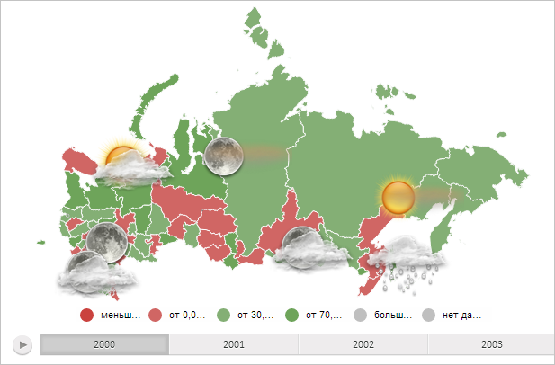

# MapChart.getMilestoneLayer

MapChart.getMilestoneLayer
-

# MapChart.getMilestoneLayer

## Синтаксис

getMilestoneLayer();

## Описание

Метод getMilestoneLayer возвращает слой значков карты.

## Комментарии

Метод возвращает значение типа SVGElement.

## Пример

Для выполнения примера необходимо наличие на html-странице компонента [MapChart](../../../Components/MapChart/MapChart.htm) с наименованием «map» (см. «[Пример создания компонента MapChart](../../../Components/MapChart/MapChart_Example.htm)»). Отобразим на карте слой значков:

// Получим слой значков карты
var milestoneLayer = map.getMilestoneLayer();
// Получим область карты
var paper = map.getPaper();
// Добавим на карту слой значков
paper.appendChild(milestoneLayer);

В результате выполнения примера на карте был отображён слой значков:

См. также:

[MapChart](MapChart.htm)

		Справочная
		 система на версию 10.9
		 от 18/08/2025,
		 © ООО «ФОРСАЙТ»,
