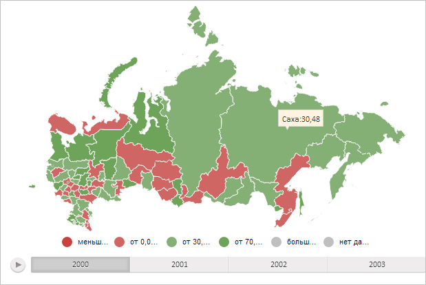

# MapChart.getToolTipLayer

MapChart.getToolTipLayer
-

# MapChart.getToolTipLayer

## Синтаксис

getToolTipLayer();

## Описание

Метод getToolTipLayer возвращает
 слой всплывающих подсказок для областей слоя карты.

## Комментарии

Метод возвращает значение типа SVGElement.

## Пример

Для выполнения примера необходимо наличие на html-странице компонента
 [MapChart](../../../Components/MapChart/MapChart.htm) с наименованием
 «map» (см. «[Пример
 создания компонента MapChart](../../../Components/MapChart/MapChart_Example.htm)»). Отобразим для области слоя карты с
 идентификатором «RU-SA» всплывающую подсказку:

// Получим область слоя карты по идентификатору «RU-SA»
var shape = map.getShape("RU-SA");
// Получим всплывающую подсказку для данной области
var toolTip = shape.getToolTip();
// Получим прямоугольник, ограничивающий область карты
var area = map.getPaperArea();
// Получим слой для всплывающих подсказок
var toolTipLayer = map.getToolTipLayer();
// Установим позицию размещения подсказки
var rect = shape.getDomNode().getBoundingClientRect();
toolTip.setTargetX(rect.left + rect.width / 2);
toolTip.setTargetY(rect.top + rect.height / 2);
// Отобразим всплывающую подсказку
toolTip.show();
// Нарисуем всплывающую подсказку
toolTip.draw(area, toolTipLayer);
В результате выполнения примера для области слоя карты с идентификатором
 «RU-SA» была отображена всплывающая подсказка:

См. также:

[MapChart](MapChart.htm)

		Справочная
		 система на версию 10.9
		 от 18/08/2025,
		 © ООО «ФОРСАЙТ»,
