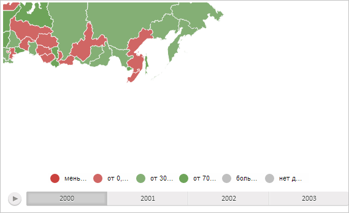

# MapChart.setViewArea

MapChart.setViewArea
-

# MapChart.setViewArea

## Синтаксис

setViewArea(area: PP.Rect, fireEvent: Boolean);

## Параметры

area. Прямоугольник, ограничивающий область просмотра карты;

fireEvent. Признак того, нужно ли генерировать событие [ViewAreaChanged](MapChart.ViewAreaChanged.htm) при изменении области просмотра карты. Если параметр равен значению true, то это событие будет сгенерировано, иначе - не будет.

## Описание

Метод setViewArea устанавливает область просмотра карты.

## Пример

Для выполнения примера необходимо наличие на html-странице компонента [MapChart](../../../Components/MapChart/MapChart.htm) с наименованием «map» (см. «[Пример создания компонента MapChart](../../../Components/MapChart/MapChart_Example.htm)»). Установим новую область просмотра карты:

// Зададим область просмотра
var area = new PP.Rect({
    Left: 50,
    Top: 100,
    Width: 300,
    Height: 200
});
// Установим для карты новую область просмотра
map.setViewArea(area);

В результате выполнения примера для карты была установлена область просмотра нового размера (ширина - 300 пикселей, высота - 200 пикселей) и с новым смещением относительно левого верхнего угла контейнера (смещение по левому краю - 50 пикселей, по верхнему - 100 пикселей):

См. также:

[MapChart](MapChart.htm)

		Справочная
		 система на версию 10.9
		 от 18/08/2025,
		 © ООО «ФОРСАЙТ»,
