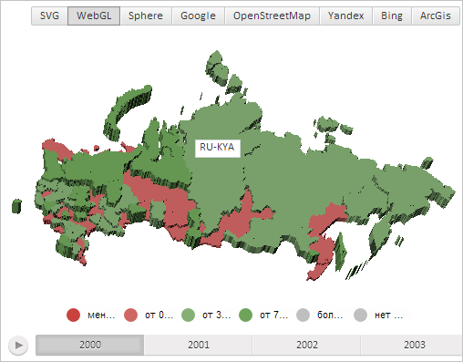

# MapContentMilestone.draw3d

MapContentMilestone.draw3d
-

# MapContentMilestone.draw3d

## Синтаксис

draw3d(scale: Number, pointZoom: [PP.Point](dhtmlCommon.chm::/Classes/PP/Point/Point.htm), offsetLeft: Number, offsetTop: Number);

## Параметры

scale. Масштаб карты;

pointZoom. Точка масштабирования;

offsetLeft. Отступ от левого края слоя;

offsetTop. Отступ от правого края слоя.

## Описание

Метод draw3d отрисовывает значок слоя трёхмерной карты.

## Пример

Для выполнения примера необходимо наличие на html-странице компонента [MapChart](../../../Components/MapChart/MapChart.htm) с наименованием «map» (см. «[Пример создания компонента MapChart](../../../Components/MapChart/MapChart_Example.htm)»). Также требуется, чтобы была загружена карта с топоосновой WebGL (см. страницу описания свойства [MapChart.TopoNormalization](../MapChart/MapChart.TopoNormalization.htm)).

Создадим на карте значок, содержащий текстовую область, и разместим его в центре области слоя трёхмерной карты с идентификатором «RU-KYA»:

// Создадим текстовую область
var textArea = new PP.Ui.TextArea({
    Width: 50,
    Height: 20,
    Content: "RU-KYA" // Текст
})
// Создадим значок для области слоя карты с идентификатором «RU-KYA»
var milestone = new PP.MapContentMilestone({
    Chart: map,
    Content: textArea, // Содержимое значка - текстовая область
    Shape: "{RU-KYA}"
});
with(milestone) {
    // Отрисуем значок
    draw3d(map.getScale(), null, 0, 0);
    // Определим расположение значка с учётом смещения на 50%
    var targetPoint = new PP.Point("0.5, 0.5");
    var point = getMilestonePosition3d(targetPoint)
    // Разместим значок в центре области слоя карты с идентификатором «RU-KYA»
    setLeft(point.getX() - textArea.getWidth() / 2);
    setTop(point.getY());
};

В результате выполнения примера в центре области слоя трёхмерной карты с идентификатором «RU-KYA» был отображён значок, содержащий текстовую область:

См. также:

[MapContentMilestone](MapContentMilestone.htm)

		Справочная
		 система на версию 10.9
		 от 18/08/2025,
		 © ООО «ФОРСАЙТ»,
