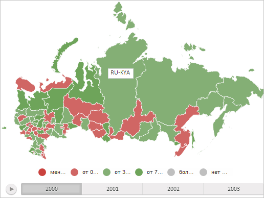

# MapContentMilestone.getMilestonePosition

MapContentMilestone.getMilestonePosition
-

# MapContentMilestone.getMilestonePosition

## Синтаксис

getMilestonePosition(offset: [PP.Point](dhtmlCommon.chm::/Classes/PP/Point/Point.htm));

## Параметры

offset. Смещение по всем осям относительно начального расположения значка, выраженное в долях от его максимально допустимого смещения.

## Описание

Метод getMilestonePosition определяет расположение значка в координатах топоосновы карты.

## Комментарии

Метод возвращает значение типа [PP.Point](dhtmlCommon.chm::/Classes/PP/Point/Point.htm).

## Пример

Для выполнения примера необходимо наличие на html-странице компонента [MapChart](../../../Components/MapChart/MapChart.htm) с наименованием «map» (см. «[Пример создания компонента MapChart](../../../Components/MapChart/MapChart_Example.htm)»). Создадим на карте значок, содержащий текстовую область, и разместим его в центре области слоя карты с идентификатором «RU-KYA»:

// Создадим текстовую область
var textArea = new PP.Ui.TextArea({
    Width: 50,
    Height: 20,
    Content: "RU-KYA" // Текст
})
// Создадим значок для области слоя карты с идентификатором «RU-KYA»
var milestone = new PP.MapContentMilestone({
    Chart: map,
    Content: textArea, // Содержимое значка - текстовая область
    Shape: "{RU-KYA}"
});
with(milestone) {
    // Отрисуем значок
    draw(map.getScale(), null, 0, 0);
    // Определим расположение значка с учётом смещения на 50%
    var targetPoint = new PP.Point("0.5, 0.5");
    var topoPoint = getMilestonePosition(targetPoint);
    // Преобразуем координаты топоосновы в экранные
    var screenPoint = getScreen2DCoord(topoPoint);
    // Разместим значок в центре области слоя карты с идентификатором «RU-KYA»
    setLeft(screenPoint.x - textArea.getWidth() / 2);
    setTop(screenPoint.y);
};

В результате выполнения примера в центре области слоя карты с идентификатором «RU-KYA» был отображён значок, содержащий текстовую область:

См. также:

[MapContentMilestone](MapContentMilestone.htm)

		Справочная
		 система на версию 10.9
		 от 18/08/2025,
		 © ООО «ФОРСАЙТ»,
