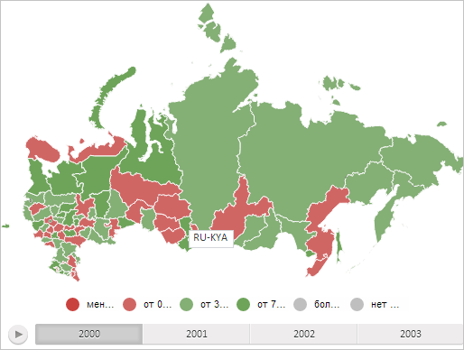

# MapContentMilestone.move

MapContentMilestone.move
-

# MapContentMilestone.move

## Синтаксис

move(offset: [PP.Point](dhtmlCommon.chm::/Classes/PP/Point/Point.htm));

## Параметры

offset. Смещение по всем осям относительно начального расположения значка, выраженное в долях от его максимально допустимого смещения.

## Описание

Метод move перемещает значок слоя карты в указанную позицию.

## Пример

Для выполнения примера необходимо наличие на html-странице объекта класса [MapContentMilestone](MapContentMilestone.htm) с наименованием «milestone» (см. страницу описания метода [MapContentMilestone.getMilestonePosition](MapContentMilestone.getMilestonePosition.htm)). Переместим значок в середину нижней границы области слоя карты, за которой он закреплён:

milestone.move(new PP.Point("0.5, 1"));

В результате выполнения данного строки сценария значок был перемещён в середину нижней границы области карты с идентификатором «RU-KYA»:

См. также:

[MapContentMilestone](MapContentMilestone.htm)

		Справочная
		 система на версию 10.9
		 от 18/08/2025,
		 © ООО «ФОРСАЙТ»,
