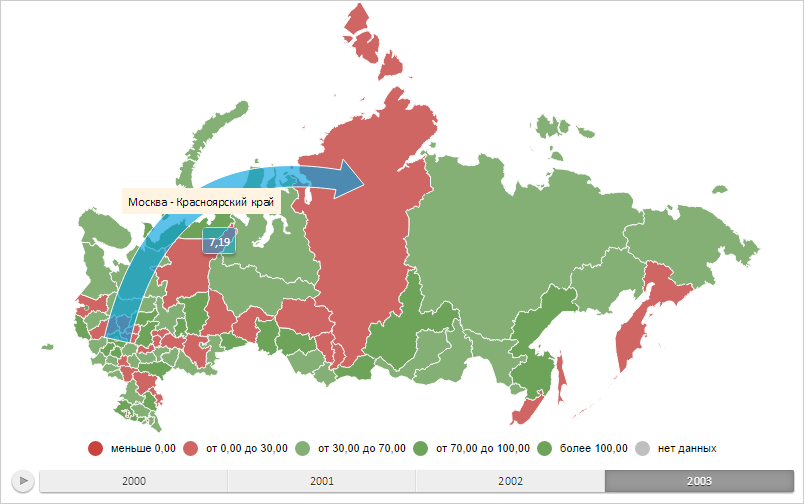

# Конструктор MapFilledArrow

Конструктор MapFilledArrow
-

# Конструктор MapFilledArrow

## Синтаксис

PP.MapFilledArrow(settings);

## Параметры

settings. JSON-объект со значениями
 свойств компонента.

## Описание

Конструктор MapFilledArrow создает
 экземпляр класса [MapFilledArrow](MapFilledArrow.htm).

## Пример

Для выполнения примера необходимо наличие на html-странице компонента
 [MapChart](../../../Components/MapChart/MapChart.htm) с наименованием
 «map» (см. «[Пример
 создания компонента MapChart](../../../Components/MapChart/MapChart_Example.htm)»). Создадим стрелку, направленную от
 области слоя карты с идентификатором «RU-MOW» к области слоя карты с идентификатором
 «RU-KYA», отобразим всплывающую подсказку для неё и метку:

// Возвращает слой с областями карты
function getWorkLayer() {
    return map.getLayer("Regions");
}
// Возвращает настройки сопоставления данных стрелки
function getArrowVisual() {
    return map.getVisuals().MapArrowVisual;
}
// Создаёт объект для работы с настройками сопоставления данных для стрелки на карте
function createArrowVisual() {
    var arrowVisual = new PP.ArrowVisual({
        ColorMapping: getArrowVisual().getColorMapping(),
        BasementWidthMapping: getArrowVisual().getBasementWidthMapping()
    });
    return arrowVisual;
}
// Выводит информацию о стрелке
function printArrowVisualInfo(mapArrow) {
    console.log("Идентификатор источника данных для первого сопоставления: %s", mapArrow.getVisual().getFirstDataSource().getId());
}
// Создаёт всплывающую подсказку
function createToolTip() {
    var toolTip = new PP.Ui.ChartTooltipBase({
        HoverMode: PP.HoverMode.Click,
        MaskText: {
            IsAuto: true,
            Value: "{%WidthValue}"
        }
    });
    return toolTip;
}
// Отрисовывает всплывающую подсказку
function drawToolTip(mapArrow) {
    // Определяем цвет заливки всплывающей подсказки
    var toolTipColor = mapArrow.getToolTipColor();
    mapArrow.getToolTip().setBackground(new PP.SolidColorBrush({
        Color: toolTipColor,
        Opacity: 0.5
    }));
    mapArrow.getToolTip().setFont(new PP.Font({
        Color: PP.Color.Colors.white
    }));
    // Отображаем всплывающую подсказку
    mapArrow.toggleToolTip();
}
// Создаёт пузырьковый показатель
function createMapArrow() {
    // Создаём стрелку с заливкой
    var mapArrow = new PP.MapFilledArrow({
        Border: {
            Color: PP.Color.Colors.white,
            Width: 1
        }, // Стиль границы стрелки
        Chart: map,
        StartShape: "RU-MOS",
        EndShape: "RU-KYA",
        Visual: createArrowVisual(), // Сопоставление данных стрелки
        Id: "Filled", // Идентификатор стрелки
        IsRelativeWidth: true,
        Label: new PP.MapLabel({
            MaskText: {
                Value: "{%StartShape} - {%EndShape}"
            }
        }),
        ToolTip: createToolTip(), // Всплывающая подсказка
        UseAnimation: true // Разрешаем воспроизведение анимации
    });
    return mapArrow;
}
// Удаляет стрелку с карты
function clearArrow(mapArrow) {
    mapArrow.getToolTip().dispose();
    mapArrow.clear();
}
// Отрисовывает стрелку на карте
function drawMapArrow(mapArrow) {
    var arrows = map.getMapArrows();
    if (arrows == null) {
        arrows = {};
    }
    arrows[mapArrow.getId()] = mapArrow;
    // Перерисовываем карту
    map.refresh();
}
// Выводит информацию, отображаемую в всплывающей подсказке
function printToolTipInfo(mapArrow) {
    console.log("Всплывающая подсказка отображает значение %s",
        mapArrow.getToolTipValues().WidthValue.value);
}
// Создаём стрелку с заливкой
var mapArrow = createMapArrow();
// Отрисовываем данную стрелку
drawMapArrow(mapArrow);
// Отображаем всплывающую подсказку
drawToolTip(mapArrow);
// Выводим информацию о настройках сопоставления данных стрелки
printArrowVisualInfo(mapArrow);
// Выводим информацию, отображаемую в всплывающей подсказке
printToolTipInfo(mapArrow);
// Настроим подсветку стрелки - стрелка будет подсвечиваться при выделении области, в которую она заходит
map.setArrowEffectsMode(PP.Ui.MapChart.ArrowEffectsMode.EndShape);
// Зададим шрифт и заливку подписи стрелки
mapArrow.setFont(
    new PP.Font({
        FontFamily: 'Impact',
        Size: 12,
        SizeUnits: PP.SizeUnits.Pt
    })
);
mapArrow.setTextBackground(
    new PP.BrushEffect({
    Brush: {
        SolidColorBrush: {
            Color: "#F7EBD1"}
        }
    })
);
// Обновим карту
map.refresh(true);
В результате выполнения примера были отображены стрелка, направленная
 от области слоя карты с идентификатором «RU-MOW» к области слоя карты
 с идентификатором «RU-KYA», всплывающая подсказка для неё и метка:

В консоли браузера были выведены идентификатор источника данных для
 первого сопоставления данных стрелки и значение, отображаемое на всплывающей
 подсказке:

Идентификатор источника данных для первого сопоставления:
 arrowSource

Всплывающая подсказка отображает значение 7.19

См. также:

[MapFilledArrow](MapFilledArrow.htm)

		Справочная
		 система на версию 10.9
		 от 18/08/2025,
		 © ООО «ФОРСАЙТ»,
