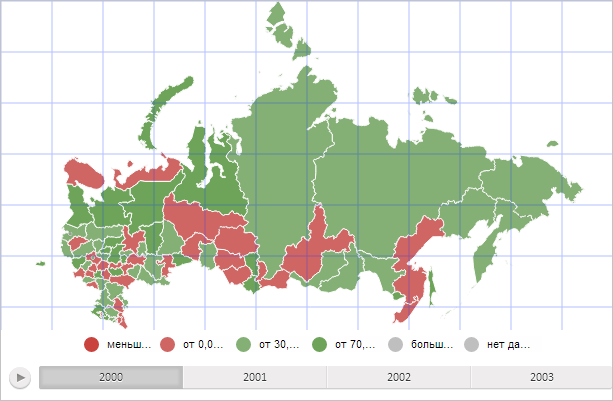

# Конструктор MapGrid

Конструктор MapGrid
-

# Конструктор MapGrid

## Синтаксис

PP.MapGrid(settings);

## Параметры

settings. JSON-объект со значениями свойств компонента.

## Описание

Конструктор MapGrid создает экземпляр класса MapGrid.

## Пример

Для выполнения примера необходимо наличие на html-странице компонента [MapChart](../../../Components/MapChart/MapChart.htm) с наименованием «map» (см. «[Пример создания компонента MapChart](../../../Components/MapChart/MapChart_Example.htm)»). Создадим и добавим на карту сетку с прозрачностью, равной 30%:

var mapGrid = new PP.MapGrid({
    Chart: map,
    Color: PP.Color.getColor("#0033FF"), // Цвет линий
    Width: map.getWidth(), // Ширина сетки
    Height: map.getHeight(), // Высота сетки
    Thickness: 1, // Толщина линий сетки
    VerticalLinesStep: 50, // Расстояние между вертикальными линиями
    HorizontalLinesStep: 50, // Расстояние между горизонтальными линиями
    // Сетку строим по пикселям
    HorizontalLinesStepType: PP.MapGridStepType.Pixels,
    VerticalLinesStepType: PP.MapGridStepType.Pixels
});
// Нарисуем сетку
mapGrid.draw();
// Установим для карты сетку
map.setMapGrid(mapGrid);
// Получим слой сетки карты
var mapGridLayer = map.getMapGridLayer();
// Установим прозрачность сетки, равную 30%
mapGridLayer.style.opacity = 0.3;

В результате выполнения примера на карту была добавлена сетка. Линии сетки имеют синий цвет, толщину в 1 пиксель и прозрачность, равную 30%. Расстояние между горизонтальными и вертикальными линиями сетки равно 50 пикселям:

См. также:

[MapGrid](MapGrid.htm)

		Справочная
		 система на версию 10.9
		 от 18/08/2025,
		 © ООО «ФОРСАЙТ»,
