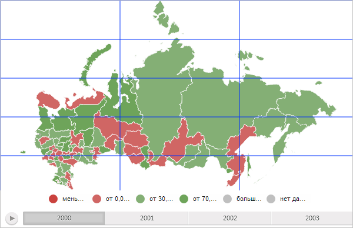

# MapGrid.HorizontalLinesCount

MapGrid.HorizontalLinesCount
-

# MapGrid.HorizontalLinesCount

## Синтаксис

HorizontalLinesCount: Number;

## Описание

Свойство HorizontalLinesCount определяет количество горизонтальных линий сетки.

## Комментарии

Значение свойства устанавливается из JSON и с помощью метода setHorizontalLinesCount.

Данное свойство актуально, если значение свойства [MapGrid.HorizontalLinesStepType](MapGrid.HorizontalLinesStepType.htm) равно PP.MapGridStepType.StepsCount.

## Пример

Для выполнения примера необходимо наличие на html-странице компонента [MapChart](../../../Components/MapChart/MapChart.htm) с наименованием «map» (см. «[Размещение карты на HTML странице](../../../Components/MapChart/HTML_layout.htm)»). Создадим и добавим на карту сетку, состоящую из трёх горизонтальных линий и пяти вертикальных:

var mapGrid = new PP.MapGrid({
    Chart: map,
    Color: PP.Color.getColor("#0033FF"), // Цвет линий
    Width: map.getWidth(), // Ширина сетки
    Height: map.getHeight(), // Высота сетки
    Thickness: 1, // Толщина линий сетки
    HorizontalLinesCount: 5, // Количество горизонтальных линий сетки
    VerticalLinesCount: 3, // Количество вертикальных линий сетки
    // Сетку строим из заданного количества линий
    HorizontalLinesStepType: PP.MapGridStepType.StepsCount,
    VerticalLinesStepType: PP.MapGridStepType.StepsCount
});
if (!mapGrid.getIsDrawed()) {
    // Нарисуем сетку
    mapGrid.draw();
};

В результате выполнения примера на карту была добавлена сетка, состоящая из трёх горизонтальных и пяти вертикальных линий синего цвета:

См. также:

[MapGrid](MapGrid.htm)

		Справочная
		 система на версию 10.9
		 от 18/08/2025,
		 © ООО «ФОРСАЙТ»,
