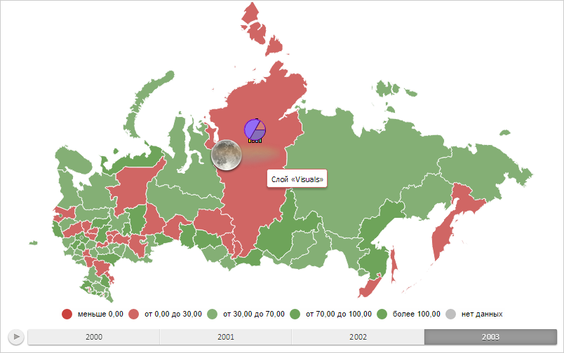

# MapLayer.PlaceVisualsOneByOne

MapLayer.PlaceVisualsOneByOne
-

# MapLayer.PlaceVisualsOneByOne

## Синтаксис

PlaceVisualsOneByOne: Boolean;

## Описание

Свойство PlaceVisualsOneByOne
 определяет, расположены ли показатели карты в одну линию.

## Комментарии

Значение свойства устанавливается из JSON и с помощью метода setPlaceVisualsOneByOne, а
 возвращается с помощью метода getPlaceVisualsOneByOne.

Допустимые значения:

	- true.
	 Показатели карты расположены в одну линию (по умолчанию);

	- false.
	 Показатели карты расположены друг за другом.

## Пример

Для выполнения примера необходимо наличие на html-странице объекта типа
 [PP.MapLayer](../MapShape/MapShape.htm) (см. страницу описания
 свойства [MapLayer.addSubLayer](MapLayer.addSubLayer.htm))
 с наименованием «layer». Отобразим показатели карты друг за другом:

// Удаляем все показатели с карты
layer.clearVisualItems();
// Обновляем карту
map.refresh();
// Создаём новый слой карты
var layer = createLayer("Visuals");
// Располагаем показатели карты друг за другом
layer.setPlaceVisualsOneByOne(false);
// Отображаем показатели карты для области слоя карты «RU-KYA»
var shapeId = "RU-KYA";
showBar(shapeId);
showPie(shapeId);
showBubble(shapeId);
// Перерисовываем карту
map.draw();
В результате выполнения примера показатели карты были отображены друг
 за другом:

См. также:

[MapLayer](MapLayer.htm)

		Справочная
		 система на версию 10.9
		 от 18/08/2025,
		 © ООО «ФОРСАЙТ»,
