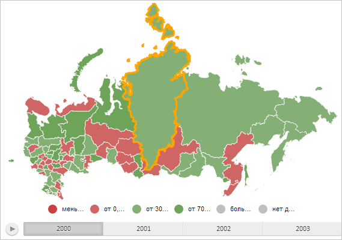

# MapLayer.addShape

MapLayer.addShape
-

# MapLayer.addShape

## Синтаксис

addShape(shapeObj: [PP.MapShape](../MapShape/MapShape.htm),
 id: Number, domNode: SVGElement, gShapeData: Array, verticesData, index:
 Number);

## Параметры

shapeObj. Добавляемая область
 слоя карты;

id. Идентификатор области слоя
 карты;

domNode. DOM-элемент, соответствующий
 области слоя карты;

gShapeData. Массив строк с
 данными области для карты с топоосновой Google. Необязательный параметр;

verticesData. Данные вершин
 области слоя карты.

## Описание

Метод addShape добавляет область
 карты на текущий слой.

## Пример

Для выполнения примера необходимо наличие на html-странице компонента
 [MapChart](../../../Components/MapChart/MapChart.htm) с наименованием
 «map» (см. «[Пример
 создания компонента MapChart](../../../Components/MapChart/MapChart_Example.htm)»). Удалим со слоя областей карты все
 элементы и добавим область с идентификатором «RU-KYA». Затем подсветим
 все доступные области:

// Получим слой с областями карты
var regions = map.getLayer("Regions");
// Получим DOM-элемент, соответствующий области слоя карты с идентификатором «RU-KYA»
var shapeDomNode = map.getShape("RU-KYA").getDomNode();
// Создадим новую область слоя карты
var newShape = new PP.MapShape({
    Chart: map,
    ParentLayer: regions,
    Id: "RU-KYA" // Идентификатор области
});
// Очистим список областей слоя карты
regions.clearShapes();
// Установим DOM-элемент для области карты
newShape._DomNode = shapeDomNode;
// Добавим область карты на слой
regions.addShape(newShape, newShape.getId(), newShape.getDomNode());
// Подсветим все области слоя на карте
for (var shapeId in regions.getShapes()) {
    var shape = map.getShape(shapeId);
    // Получим эффект границы области
    var effect = shape.getEffect();
    // Изменим толщину границы
    effect.setBorderThickness(3);
    // Применим эффект
    effect.apply(shape, true);
};
В результате выполнения примера была подсвечена только область слоя
 карты с идентификатором «RU-KYA», остальные области были удалены:

См. также:

[MapLayer](MapLayer.htm)

		Справочная
		 система на версию 10.9
		 от 18/08/2025,
		 © ООО «ФОРСАЙТ»,
