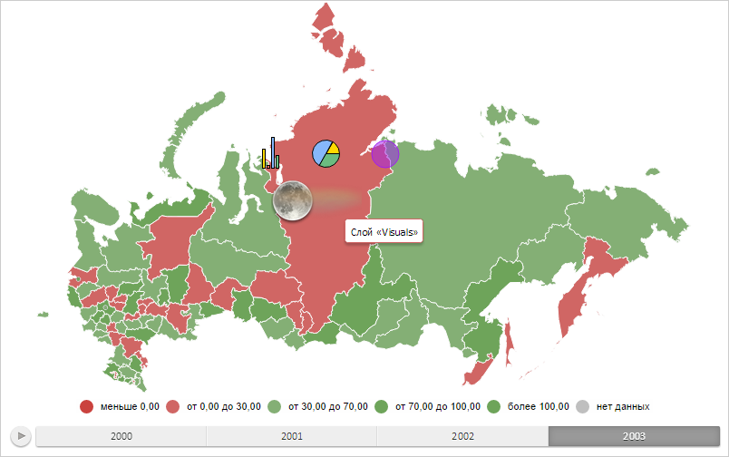

# MapLayer.addSubLayer

MapLayer.addSubLayer
-

# MapLayer.addSubLayer

## Синтаксис

addSubLayer(layer: [PP.MapLayer](MapLayer.htm),
 id: String);

## Параметры

layer. Добавляемый дочерний
 слой;

id. Идентификатор добавляемого
 слоя.

## Описание

Метод addSubLayer добавляет
 дочерний слой.

## Пример

Для выполнения примера необходимо наличие на html-странице компонента
 [MapChart](../../../Components/MapChart/MapChart.htm) с наименованием
 «map» (см. «[Пример
 создания компонента MapChart](../../../Components/MapChart/MapChart_Example.htm)»). Добавим для слоя с идентификатором
 «Regions» дочерний слой «Visuals», в котором разместим столбиковый, круговой
 и пузырьковый показатели. Отобразим также значок и всплывающую подсказку
 для области слоя карты «RU-KYA». Родительский слой скроем:

// Создаёт всплывающую подсказку для слоя карты
function createToolTip() {
    var toolTip = new PP.Ui.ChartTooltipBase({
        HoverMode: PP.HoverMode.Click,
        MaskText: {
            IsAuto: true,
            Value: "Слой «Visuals»"
        }
    });
    toolTip.setFont(new PP.Font());
    return toolTip;
}
// Отрисовывает всплывающую подсказку
function drawToolTip(shapeId) {
    var shape = getWorkLayer().getShape(shapeId);
    shape.setToolTip(getWorkLayer().getToolTip());
    var point = shape.getCenter();
    shape.toggleTooltip(point.getX(), point.getY());
}
// Создаёт слой карты
function createLayer(layerId) {
    var parentLayer = getParentLayer();
    // Создаём слой с показателями карты
    var visualsLayer = new PP.MapLayer({
        Chart: map,
        DomNode: parentLayer.getDomNode(),
        VisualsOffset: 35,
        Id: layerId,
        IsVisible: false, // Скрытый слой
        ParentLayer: parentLayer,
        Shapes: parentLayer.getShapes(),
        Visual: parentLayer.getVisual()
    });
    // Устанавливаем всплывающую подсказку
    visualsLayer.setToolTip(createToolTip());
    visualsLayer.setMilestones(getMilestones());
    visualsLayer._MapBarCollection = getMapBarCollection();
    visualsLayer._MapPieCollection = getMapPieCollection();
    visualsLayer._MapBubbleCollection = getMapBubbleCollection();
    visualsLayer.setVisual(parentLayer.getVisual());
    parentLayer.addSubLayer(visualsLayer, layerId);
    visualsLayer.draw();
    // Отображаем дочерний слой карты
    if (!visualsLayer.getIsLayersVisible()) {
        visualsLayer.show();
    }
    return visualsLayer;
}
// Возвращает коллекцию значков
function getMilestones() {
    var milestones = {};
    for (var i in getParentLayer().getMilestones()) {
        milestones[i] = getParentLayer().getMilestones()[i];
        delete getParentLayer().getMilestones()[i];
    }
    return milestones;
}
// Возвращает коллекцию столбиковых показателей
function getMapBarCollection() {
    var barCollection = [];
    for (var i in getParentLayer().getMapBarCollection()) {
        var bar = getParentLayer().getMapBarCollection()[i];
        barCollection.push(bar);
    }
    getParentLayer().getMapBarCollection().length = 0;
    return barCollection;
}
// Возвращает коллекцию круговых показателей
function getMapPieCollection() {
    var pieCollection = [];
    for (var i in getParentLayer().getMapPieCollection()) {
        var bar = getParentLayer().getMapPieCollection()[i];
        pieCollection.push(bar);
    }
    getParentLayer().getMapPieCollection().length = 0;
    return pieCollection;
}
// Возвращает коллекцию пузырьковых показателей
function getMapBubbleCollection() {
    var bubbleCollection = [];
    for (var i in getParentLayer().getMapBubbleCollection()) {
        var bar = getParentLayer().getMapBubbleCollection()[i];
        bubbleCollection.push(bar);
    }
    getParentLayer().getMapBubbleCollection().length = 0;
    return bubbleCollection;
}
// Возвращает слой с показателями карты
function getWorkLayer() {
    var layer = getParentLayer().getSubLayer("Visuals");
    return layer;
}
// Возвращает слой с областями карты
function getParentLayer() {
    var layer = map.getLayer("Regions");
    return layer;
}
// Отображает столбиковый показатель для указанной области слоя карты
function showBar(shapeId) {
    var bars = getWorkLayer().getMapBarCollection();
    for (var i in bars) {
        var bar = bars[i];
        if (bar.getShape().getId() == shapeId) {
            bar.setIsVisible(true);
            bar.draw();
        }
    }
}
// Отображает круговой показатель для указанной области слоя карты
function showPie(shapeId) {
    var pies = getWorkLayer().getMapPieCollection();
    for (var i in pies) {
        var pie = pies[i];
        if (pie.getShape().getId() == shapeId) {
            pie.setIsVisible(true);
            pie.draw();
        }
    }
}
// Отображает пузырьковый показатель для указанной области слоя карты
function showBubble(shapeId) {
    var bubbles = getWorkLayer().getMapBubbleCollection();
    for (var i in bubbles) {
        var bubble = bubbles[i];
        if (bubble.getShape().getId() == shapeId) {
            bubble.setIsVisible(true);
            bubble.draw();
        }
    }
}
// Отображает значок для указанной области слоя карты
function showMilestone(shapeId) {
    var parentLayer = map.getLayer("Regions");
    var milestones = getWorkLayer().getMilestones();
    for (var i in milestones) {
        var milestone = milestones[i];
        if (milestone.getShape().getId() == shapeId) {
            milestone.draw();
            map.getPaper().appendChild(milestone.getDomNode());
        }
    }
}
var shapeId = "RU-KYA";
// Создаём новый слой
var layer = createLayer("Visuals");
// Отрисовываем показатели и значок
showBar(shapeId);
showPie(shapeId);
showBubble(shapeId);
showMilestone(shapeId);
// Отображаем всплывающую подсказку
drawToolTip(shapeId);
// Перерисовываем карту
map.draw();
В результате выполнения примера для слоя с идентификатором «Regions»
 был добавлен дочерний слой «Visuals», в котором размещены столбиковый,
 круговой и пузырьковый показатели. Для области слоя карты «RU-KYA» были
 отображены значок и всплывающая подсказка:

См. также:

[MapLayer](MapLayer.htm)

		Справочная
		 система на версию 10.9
		 от 18/08/2025,
		 © ООО «ФОРСАЙТ»,
