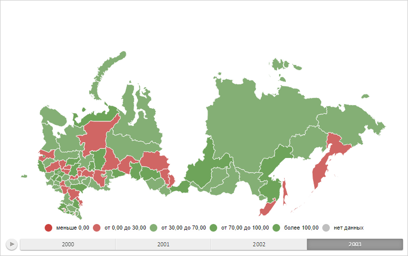

# MapLayer.removeShape

MapLayer.removeShape
-

# MapLayer.removeShape

## Синтаксис

removeShape(id: String, notDispose: Boolean);

## Параметры

id. Идентификатор области слоя
 карты;

notDispose. Признак того, требуется
 ли удалить область слоя карты только со слоя. Допустимые значения:

	- true.
	 Требуется удалить область только со слоя карты;

	- false.
	 Требуется полностью удалить область слоя карты (по умолчанию).

## Описание

Метод removeShape удаляет область
 слоя карты.

## Пример

Для выполнения примера необходимо наличие на html-странице компонента
 [MapChart](../../../Components/MapChart/MapChart.htm) с наименованием
 «map» (см. «[Пример
 создания компонента MapChart](../../../Components/MapChart/MapChart_Example.htm)»). Удалим область слоя карты с идентификатором
 «RU-KYA»:

var layer = map.getLayer("Regions");
layer.removeShape("RU-KYA");
В результате выполнения примера область слоя карты с идентификатором
 «RU-KYA» была удалена:

См. также:

[MapLayer](MapLayer.htm)

		Справочная
		 система на версию 10.9
		 от 18/08/2025,
		 © ООО «ФОРСАЙТ»,
