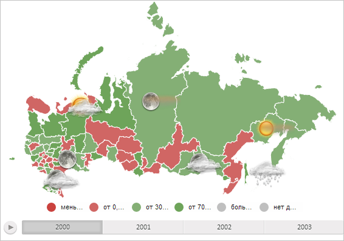

# MapLayer.updateMilestones

MapLayer.updateMilestones
-

# MapLayer.updateMilestones

## Синтаксис

updateMilestones(s: Number, pointZoom: [PP.Point](dhtmlCommon.chm::/Classes/PP/Point/Point.htm),
 offsetLeft: Number, offsetTop: Number);

## Параметры

s. Масштаб слоя значков карты;

pointZoom. Точка масштабирования;

offsetLeft. Отступ от левого
 края слоя значков карты;

offsetTop. Отступ от верхнего
 края слоя.

## Описание

Метод updateMilestones обновляет
 значки, расположенные на текущем и дочерних слоях карты.

## Пример

Для выполнения примера необходимо наличие на html-странице компонента
 [MapChart](../../../Components/MapChart/MapChart.htm) с наименованием
 «map» (см. «[Пример
 создания компонента MapChart](../../../Components/MapChart/MapChart_Example.htm)»). Отобразим на карте значки, обновим
 их расположение и обработаем событие MouseDown,
 выводя в консоли браузера при нажатии на значок идентификатор соответствующей
 ему области слоя:

// Получим слой с областями карты
var regions = map.getLayer("Regions");
// Получим слой значков карты
var milestoneLayer = map.getMilestoneLayer();
// Добавим значки на слой карты
regions.getDomNode().appendChild(milestoneLayer);
// Обновим значки карты
regions.updateMilestones(1, null, 30, 0);
// При нажатии на значок будем определять соответствующую ему область слоя карты
for (var n in regions._Milestones) {
    // Привяжем к значку события
    regions._Milestones[n]._bindEvents();
    // Получим DOM-элемент значка
    var node = regions._Milestones[n].getDomNode();
    // Обработаем событие MouseDown
    regions._Milestones[n].MouseDown.add(function (sender, args) {
        console.log("Область, соответствующая нажатому значку: " + sender.getShape().getId());
    });
};
В результате выполнения примера на карте был отображён слой значков,
 их расположение было обновлено:

При нажатии на значок в консоли браузера будет выводиться идентификатор
 соответствующей ему области слоя карты:

Область, соответствующая нажатому значку: RU-ROS

Область, соответствующая нажатому значку: RU-MO

Область, соответствующая нажатому значку: RU-NEN

См. также:

[MapLayer](MapLayer.htm)

		Справочная
		 система на версию 10.9
		 от 18/08/2025,
		 © ООО «ФОРСАЙТ»,
