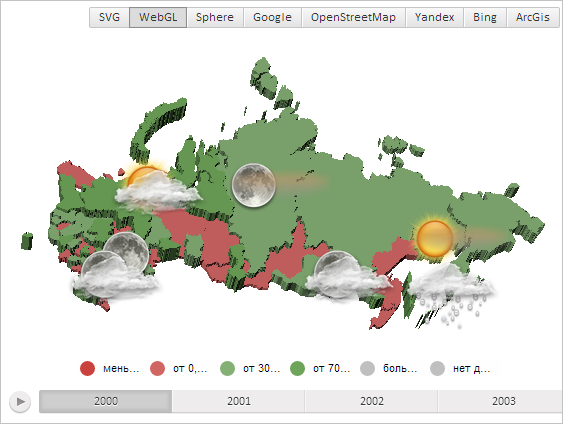

# MapLayer.updateMilestones3d

MapLayer.updateMilestones3d
-

# MapLayer.updateMilestones3d

## Синтаксис

updateMilestones3d();

## Описание

Метод updateMilestones3d обновляет значки, расположенные на текущем и дочерних слоях трёхмерной карты.

## Пример

Для выполнения примера необходимо наличие на html-странице компонента [MapChart](../../../Components/MapChart/MapChart.htm) с наименованием «map» (см. «[Пример создания компонента MapChart](../../../Components/MapChart/MapChart_Example.htm)»). Также требуется, чтобы была загружена карта с топоосновой WebGL (см. страницу описания свойства [MapChart.TopoNormalization](../MapChart/MapChart.TopoNormalization.htm)).

Отобразим на карте значки и обновим их расположение:

// Получим слой с областями карты
var regions = map.getLayer("Regions");
// Получим слой значков карты
var milestoneLayer = map.getMilestoneLayer();
// Добавим значки на слой карты
map.getPaper().appendChild(milestoneLayer);
// Разместим значки слоя правее на 0.01 единицы
for (var n in regions._Milestones) {
    // Получим куб, ограничивающий соответствующую значку область слоя
    var box = regions._Milestones[n].getShape().getBoundingBox();
    box.setLeft(box.getLeft() + 0.01);
};
// Обновим значки карты
regions.updateMilestones3d();

В результате выполнения примера на карте были отображены значки, сдвинутые правее на 0.01 единицы:

См. также:

[MapLayer](MapLayer.htm)

		Справочная
		 система на версию 10.9
		 от 18/08/2025,
		 © ООО «ФОРСАЙТ»,
