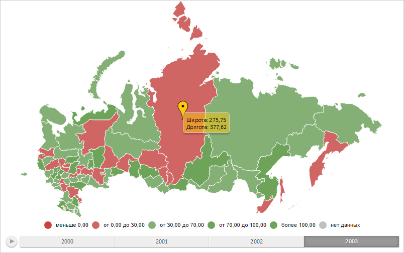

# Конструктор MapMarker

Конструктор MapMarker
-

# Конструктор MapMarker

## Синтаксис

PP.MapMarker(settings);

## Параметры

settings. JSON-объект со значениями
 свойств класса.

## Описание

Конструктор MapMarker создает
 экземпляр класса MapMarker.

## Пример

Для выполнения примера необходимо наличие на html-странице компонента
 [MapChart](../../../Components/MapChart/MapChart.htm) с наименованием
 «map» (см. «[Пример
 создания компонента MapChart](../../../Components/MapChart/MapChart_Example.htm)»). Создадим метку на карте и отобразим
 всплывающую подсказку для неё:

// Возвращает слой с областями карты
function getWorkLayer() {
    return map.getLayer("Regions");
}
// Возвращает базовый класс метки на карте
function getMarkerVisual() {
    return map.getVisuals().MarkerVisual0;
}
// Создаёт всплывающую подсказку
function createToolTip() {
    var toolTip = new PP.Ui.ChartTooltipBase({
        HoverMode: PP.HoverMode.Click,
        MaskText: {
            IsAuto: true,
            Value: "Широта: {%LatValue}\nДолгота: {%LongValue}"
        }
    });
    toolTip.setFont(new PP.Font());
    return toolTip;
}
// Отрисовывает всплывающую подсказку
function drawToolTip(mapMarker) {
    // Определяем цвет заливки всплывающей подсказки
    var toolTipColor = mapMarker.getToolTipColor();
    mapMarker.getToolTip().setBackground(new PP.SolidColorBrush({
        Color: toolTipColor,
        Opacity: 0.5
    }));
    // Отображаем всплывающую подсказку
    mapMarker.toggleToolTip();
}
// Создаёт метку
function createMapMarker() {
    var mapMarker = new PP.MapMarker({
        Chart: map,
        Layer: getWorkLayer(), // Слой карты
        ToolTip: createToolTip(), // Всплывающая подсказка
        Visual: getMarkerVisual(),
        Id: "m00" // Идентификатор
    });
    return mapMarker;
}
// Отрисовывает метку
function drawMapMarker(mapMarker) {
    var markers = map.getMapMarkers();
    if (markers == null) {
        markers = {};
    }
    markers[mapMarker.getId()] = mapMarker;
    map.setMapMarkers(markers);
    // Заново отрисовываем карту
    map.draw();
}
// Создаём метку
var mapMarker = createMapMarker();
// Отрисовываем данную метку
drawMapMarker(mapMarker);
// Отображаем всплывающую подсказку
drawToolTip(mapMarker);
// Получим цвет всплывающей подсказки
console.log("Цвет всплывающей подсказки: " + mapMarker.getTooltipColor());
В результате выполнения примера на карте были отображены метка и всплывающая
 подсказка:

См. также:

[MapMarker](MapMarker.htm)

		Справочная
		 система на версию 10.9
		 от 18/08/2025,
		 © ООО «ФОРСАЙТ»,
