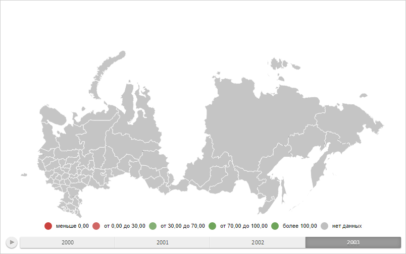

# MapObject.hide

MapObject.hide
-

# MapObject.hide

## Синтаксис

hide();

## Описание

Метод hide скрывает объект на
 карте.

## Пример

Для выполнения примера необходимо наличие на html-странице объекта типа
 [PP.MapShape](../MapShape/MapShape.htm) (см. страницу описания
 свойства [MapShape.Visual](../MapShape/MapShape.Visual.htm))
 с наименованием «mapShape». Скроем область слоя карты и всплывающую подсказку
 для неё:

function hideMapShape(mapShape) {
    mapShape.getToolTip().hide();
    mapShape.hide();
}
hideMapShape(mapShape);
В результате выполнения примера область слоя карты с идентификатором
 «RU-KYA» и всплывающая подсказка для неё были скрыты:

Теперь снова отобразим их:

function showMapShape(mapShape) {
    mapShape.getToolTip().show();
    mapShape.show();
}
showMapShape(mapShape);
После выполнения примера область слоя карты и подсказка были вновь отображены.

См. также:

[MapObject](MapObject.htm)

		Справочная
		 система на версию 10.9
		 от 18/08/2025,
		 © ООО «ФОРСАЙТ»,
