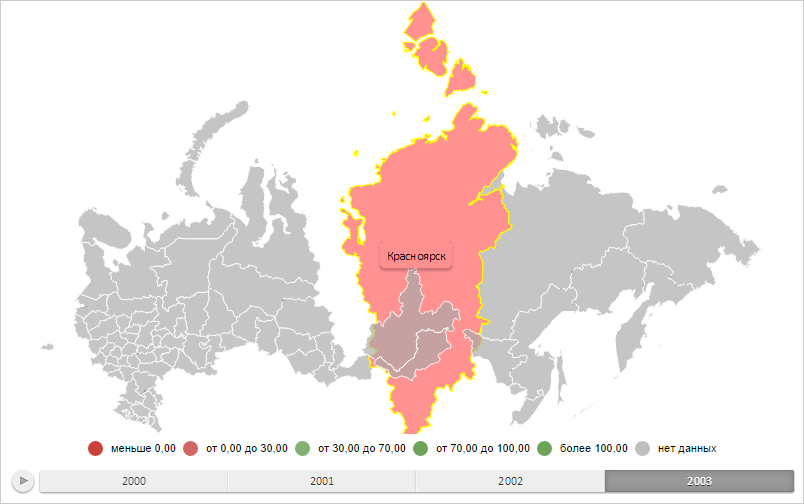

# MapObject.scale

MapObject.scale
-

# MapObject.scale

## Синтаксис

scale(factor: Double);

## Параметры

factor. Коэффициент масштабирования.

## Описание

Метод scale масштабирует объект
 на карте.

## Пример

Для выполнения примера необходимо наличие на html-странице объекта типа
 [PP.MapShape](../MapShape/MapShape.htm) (см. страницу описания
 свойства [MapShape.Visual](../MapShape/MapShape.Visual.htm))
 с наименованием «mapShape». Увеличим масштаб отображения области слоя
 карты в 1,2 раза:

mapShape.scale(1.2);
В результате выполнения примера масштаб отображения области слоя карты
 был увеличен в 1,2 раза:

См. также:

[MapObject](MapObject.htm)

		Справочная
		 система на версию 10.9
		 от 18/08/2025,
		 © ООО «ФОРСАЙТ»,
