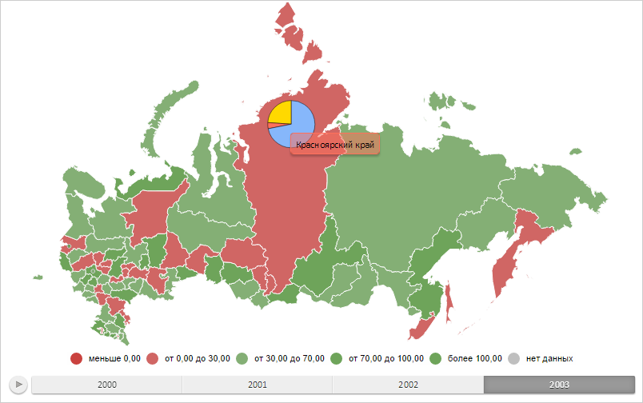

# Конструктор MapPie

Конструктор MapPie
-

# Конструктор MapPie

## Синтаксис

PP.MapPie(settings);

## Параметры

settings. JSON-объект со значениями
 свойств класса.

## Описание

Конструктор MapPie создаёт экземпляр
 класса MapPie.

## Пример

Для выполнения примера необходимо наличие на html-странице компонента
 [MapChart](../../../Components/MapChart/MapChart.htm) с наименованием
 «map» (см. «[Пример
 создания компонента MapChart](../../../Components/MapChart/MapChart_Example.htm)»). Создадим круговой показатель для области
 слоя карты с идентификатором «RU-KYA» и отобразим всплывающую подсказку
 для него:

// Возвращает слой с областями карты
function getWorkLayer() {
    return map.getLayer("Regions");
}
// Возвращает текущую отметку измерения для оси карты
function getTimelineIndex() {
    return 1;
}
// Возвращает базовый класс кругового показателя карты
function getPieVisual() {
    return map.getVisuals().pieVisual0;
}
// Создаёт объект для работы с настройками сопоставления данных для кругового показателя
function createPieVisual() {
    var pieVisual = new PP.PieVisual({

        AngleMappings: getPieVisual().getAngleMappings(),
        BorderMappings: getPieVisual().getBorderMappings(),
        ColorMappings: getPieVisual().getColorMappings(),
        RadiusMappings: getPieVisual().getRadiusMappings()
    });
    // Настраиваем объект базового класса кругового показателя
    pieVisual.setup(getTimelineIndex());
    return pieVisual;
}
// Выводит информацию о столбиковом показателе
function printPieVisualInfo(mapPie) {
    console.log("Главное сопоставление данных: %s", mapPie.getMainMappingId(getTimelineIndex()));
    console.log("Максимальное количество сопоставлений данных: %s", mapPie.getVisual().getMappingsCount());
    console.log("Идентификатор источника данных для первого сопоставления: %s", mapPie.getVisual().getFirstDataSource().getId());
}

// Возвращает область слоя карты с указанным идентификатором
function getShape(shapeId) {
    var shape = getWorkLayer().getParentLayer().getShape(shapeId);
    map.setPieHoverness(shape);
    return shape;
}
// Создаёт всплывающую подсказку
function createToolTip() {
    var toolTip = new PP.Ui.ChartTooltipBase({
        HoverMode: PP.HoverMode.Click,
        MaskText: {

            IsAuto: true,
            Value: "{%Name}"
        }
    });
    toolTip.setFont(new PP.Font());
    return toolTip;
}
// Отрисовывает всплывающую подсказку
function drawToolTip(mapPie) {
    // Определяем цвет заливки всплывающей подсказки
    var toolTipColor = mapPie.getToolTipColor();

    mapPie.getToolTip().setBackground(new PP.SolidColorBrush({
        Color: toolTipColor,
        Opacity: 0.5
    }));
    // Отображаем всплывающую подсказку
    mapPie.toggleToolTip();
}
// Создаёт круговой показатель
function createMapPie() {
    // Создаём круговой показатель
    var mapPie = new PP.MapPie({
        Chart: map,
        Shape: getShape("RU-KYA"),
        MaxPiesCount: 3, // Максимальное количество секторов кругового показателя

        BorderThickness: 0.5, // Толщина границ секторов
        HideNoData: false, // Скроем сектора, соответствующие нулевым значениям
        Visual: createPieVisual(),
        Layer: getWorkLayer(), // Слой карты
        LeastAnglePart: 15, // Минимальный размер сектора
        LeastRadiusPart: 30, // Минимальный радиус сектора
        StartAngle: 90, // Угол поворота первого сектора
        ToolTip: createToolTip(), // Всплывающая подсказка
    });
    // Обновляет круговой показатель
    mapPie.refresh = function() {
        // Удаляем круговой показатель со слоя карты
        clearMapPie(this);

        // Проверяем наличие нескольких сопоставлений данных
        if (!mapPie.isMeta()) {
            this._isDrawed = false;
        }
        // Перерисовываем круговой показатель
        this.draw();
        // Отображаем круговой показатель
        this.renderFrame(this.getChart().getPieLayer())
    };
    return mapPie;
}
// Удаляет круговой показатель со слоя карты
function clearMapPie(mapPie) {
    mapPie.clear();

    mapPie.getChart().getPieLayer().clear();
}
// Отрисовывает круговой показатель
function drawMapPie(mapPie) {
    mapPie.setSelectedIndex(getTimelineIndex());
    mapPie.getLayer().getMapPieCollection().push(mapPie);
    // Заново отрисовываем карту
    map.draw();
}
// Выводит информацию, отображаемую в всплывающей подсказке
function printToolTipInfo(mapPie) {
    // Устанавливаем круговой показатель
    var pie1 = {};
    var pieKey = "mapPie";
    pie1[pieKey] = mapPie.getSettings();
    getWorkLayer().setPies(pie1);
    var pie2 = getWorkLayer().getPies()["mapPie"];

    console.log("Всплывающая подсказка отображает данные для региона «%s» за %s год",
        pie2.getShapeId(), pie2.getToolTipValues().TimelineStep);
}
// Создаём круговой показатель
var mapPie = createMapPie();
// Отрисовываем данный показатель
drawMapPie(mapPie);
// Отображаем всплывающую подсказку
drawToolTip(mapPie);
В результате выполнения примера были отображены круговой показатель
 для области слоя карты с идентификатором «RU-KYA» и всплывающая подсказка
 для данного показателя:

Теперь определим информацию о настройках сопоставления данных для столбикового
 показателя:

printPieVisualInfo(mapPie);
После выполнения данной строки сценария в консоли браузера были выведены
 наименование главного сопоставления данных, максимальное количество настроек
 сопоставлений данных и идентификатор источника данных для первого сопоставления:

Главное сопоставление данных: pieAngle0

Максимальное количество сопоставлений данных: 1

Идентификатор источника данных для первого сопоставления:
 BarBackSource

Определим, для какого региона и за какой год
 отображены данные на всплывающей подсказке:

printToolTipInfo(mapPie);
После выполнения примера в консоли браузера будут выведены идентификатор
 региона и год, для которых отображены данные на подсказке:

Всплывающая подсказка отображает данные для региона
 «RU-KYA» за 2003 год

См. также:

[MapPie](MapPie.htm)

		Справочная
		 система на версию 10.9
		 от 18/08/2025,
		 © ООО «ФОРСАЙТ»,
