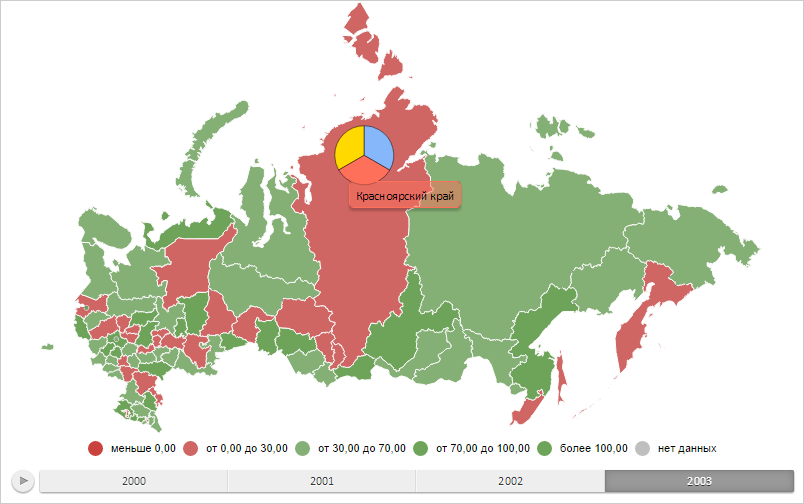

# MapPie.IsProportional

MapPie.IsProportional
-

# MapPie.IsProportional

## Синтаксис

IsProportional: Boolean;

## Описание

Свойство IsProportional определяет,
 равны ли углы секторов круговой диаграммы между собой.

## Комментарии

Значение свойства устанавливается из JSON и с помощью метода setIsProportional,
 а возвращается с помощью метода getIsProportional.

Допустимые значения:

	- true.
	 Углы всех секторов круговой диаграммы равны между собой;

	- false.
	 Углы секторов круговой диаграммы равны установленным значениям (по
	 умолчанию).

## Пример

Для выполнения примера необходимо наличие на html-странице объекта типа
 [MapPie](MapPie.htm) с наименованием «mapPie» (см. «[Конструктор
 MapPie](Constructor_MapPie.htm)»). Установим для всех секторов кругового показателя равные
 углы:

mapPie.setIsProportional(true);
// Обновляем круговой показатель
mapPie.refresh();
В результате выполнения примера для всех секторов кругового показателя
 были установлены равные углы:

См. также:

[MapPie](MapPie.htm)

		Справочная
		 система на версию 10.9
		 от 18/08/2025,
		 © ООО «ФОРСАЙТ»,
