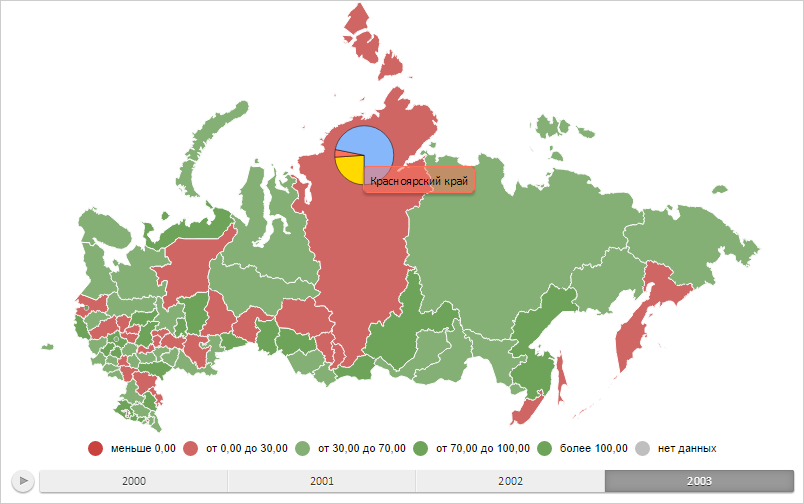

# MapPie.UseInvertedAngles

MapPie.UseInvertedAngles
-

# MapPie.UseInvertedAngles

## Синтаксис

UseInvertedAngles: Boolean;

## Описание

Свойство UseInvertedAngles определяет
 признак того, инвертирован ли угол поворота первого сегмента кругового
 показателя.

## Комментарии

Значение свойства устанавливается из JSON и с помощью метода setUseInvertedAngles,
 а возвращается с помощью метода getUseInvertedAngles.

Допустимые значения:

	- true.
	 Угол поворота первого сегмента кругового показателя инвертирован;

	- false.
	 Угол поворота первого сегмента кругового показателя не инвертирован
	 (по умолчанию).

## Пример

Для выполнения примера необходимо наличие на html-странице объекта типа
 [MapPie](MapPie.htm) с наименованием «mapPie» (см. «[Конструктор
 MapPie](Constructor_MapPie.htm)»). Инвертируем угол поворота первого сегмента кругового показателя:

mapPie.setUseInvertedAngles(true);
// Обновляем круговой показатель
mapPie.refresh();
В результате выполнения примера угол поворота первого сегмента кругового
 показателя был инвертирован, то есть знак его значения был изменён на
 противоположный:

См. также:

[MapPie](MapPie.htm)

		Справочная
		 система на версию 10.9
		 от 18/08/2025,
		 © ООО «ФОРСАЙТ»,
