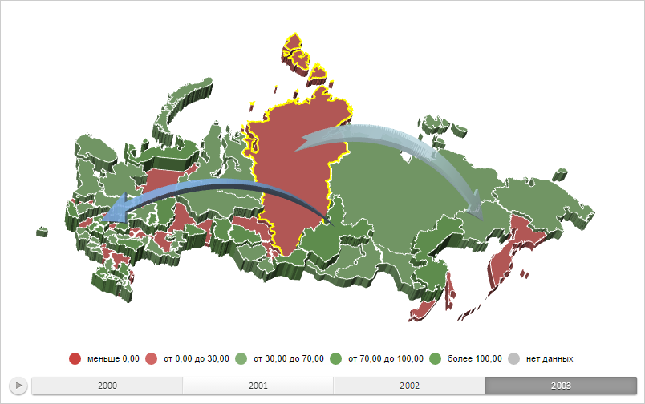

# MapShape.BorderColor

MapShape.BorderColor
-

# MapShape.BorderColor

## Синтаксис

BorderColor: String;

## Описание

Свойство BorderColor определяет
 цвет границы для области слоя карты.

## Комментарии

Значение свойства устанавливается из JSON и с помощью метода setBorderColor,
 а возвращается с помощью метода getBorderColor.

Свойство работает только для трёхмерной карты.

## Пример

Для выполнения примера необходимо наличие на html-странице компонента
 [MapChart](../../../Components/MapChart/MapChart.htm) с наименованием
 «map» (см. «[Пример
 создания компонента MapChart](../../../Components/MapChart/MapChart_Example.htm)»). Также должна быть загружена карта
 типа «WebGL», для этого нужно выполнить следующую строку сценария:

changeMapType("WebGL");
Установим для области слоя трёхмерной карты с идентификатором «RU-KYA»
 границу жёлтого цвета и толщиной, равной 2 пикселям:

// Устанавливаем цвет для границы области слоя карты
shape.setBorderColor(PP.Color.Colors.yellow);
// Устанавливаем толщину границы
shape.setStrokeWidth(2);
// Отрисовываем границу
shape.renderBorder3d();
В результате выполнения примера для области слоя трёхмерной карты с
 идентификатором «RU-KYA» были установлены граница жёлтого цвета и толщина,
 равная 2 пикселям:

См. также:

[MapShape](MapShape.htm)

		Справочная
		 система на версию 10.9
		 от 18/08/2025,
		 © ООО «ФОРСАЙТ»,
