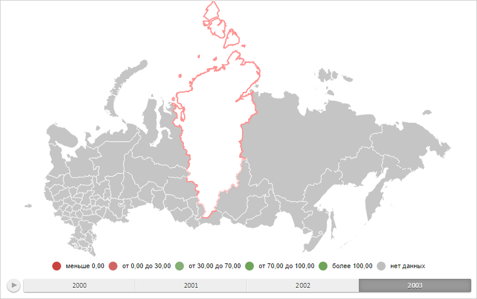

# MapShape.IsStroked

MapShape.IsStroked
-

# MapShape.IsStroked

## Синтаксис

IsStroked: Boolean;

## Описание

Свойство IsStroked определяет,
 включён ли режим рисования области слоя карты с контуром и без заливки.

## Комментарии

Значение свойства устанавливается из JSON и с помощью метода setIsStroked,
 а возвращается с помощью метода getIsStroked.

Допустимые значения:

	- true.
	 Режим рисования области слоя карты с контуром и без заливки включён;

	- false.
	 Режим рисования области слоя карты с контуром и без заливки выключен
	 (по умолчанию).

## Пример

Для выполнения примера необходимо наличие на html-странице объекта типа
 [PP.MapShape](MapShape.htm) (см. страницу описания свойства
 [MapShape.Visual](MapShape.Visual.htm)) с наименованием «mapShape».
 Отобразим слой области карты с контуром толщиной, равной 2 пикселям, и
 без заливки:

mapShape.setIsStroked(true);
// Устанавливаем толщину линии
mapShape.setStrokeWidth(2);
// Перерисовываем карту
map.draw();
В результате выполнения примера область слоя карты с идентификатором
 «RU-KYA» была отображена с контуром, толщина которого равна 2 пикселям,
 и без заливки:

См. также:

[MapShape](MapShape.htm)

		Справочная
		 система на версию 10.9
		 от 18/08/2025,
		 © ООО «ФОРСАЙТ»,
